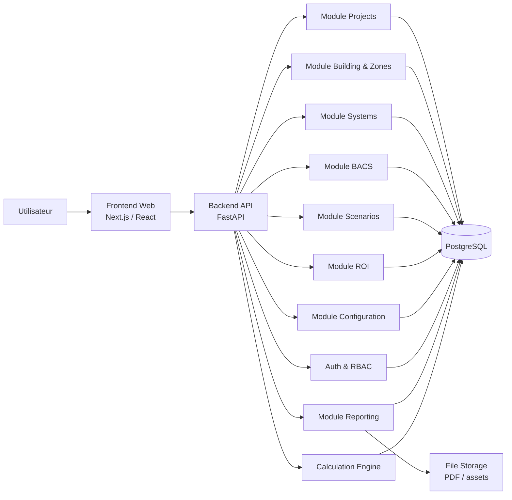
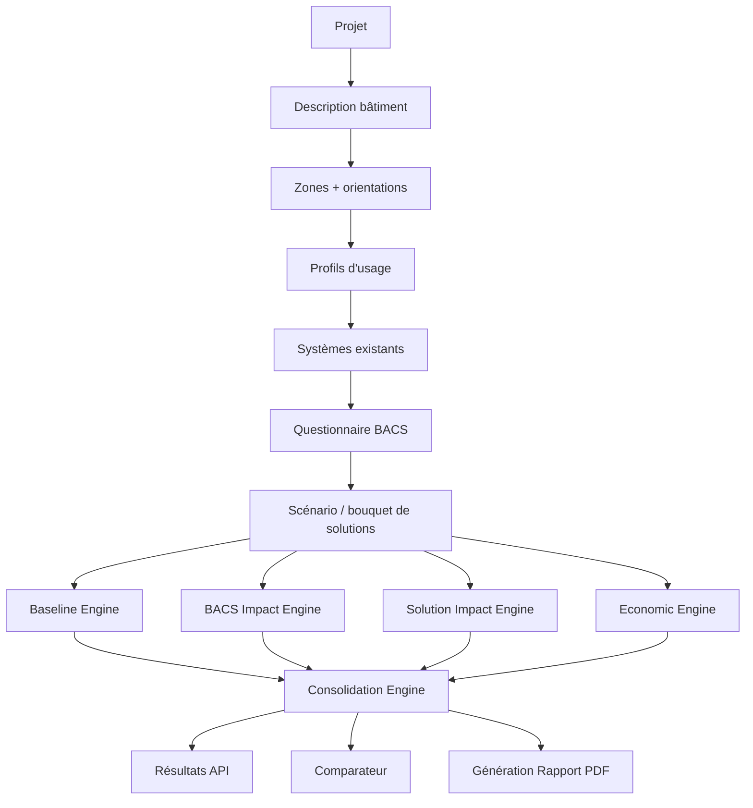
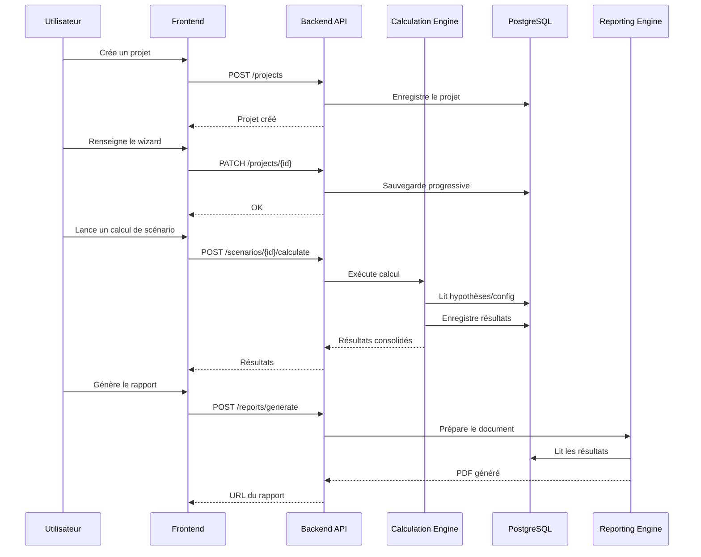
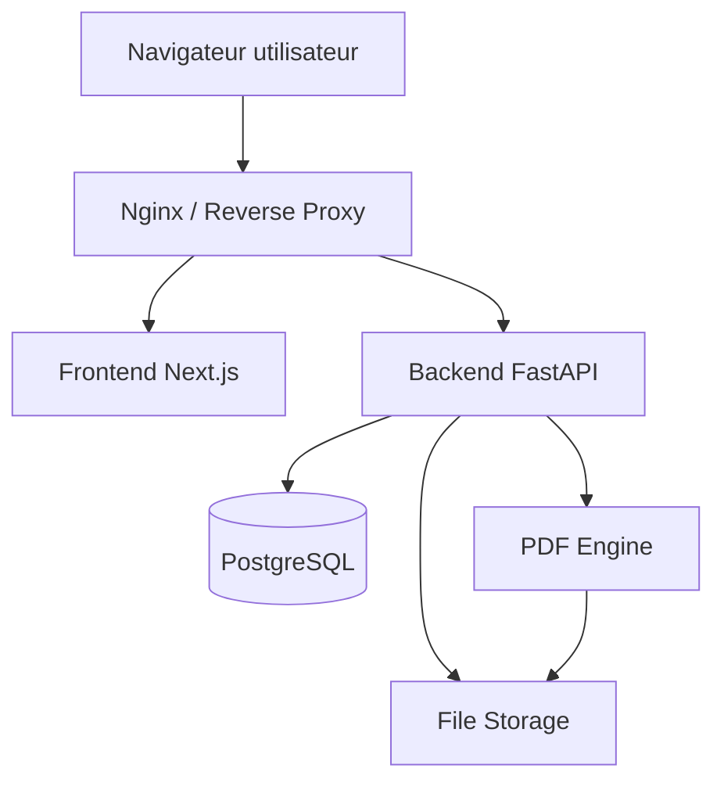

# 1. Architecture technique détaillée

## 1.1 Principes d’architecture

L’application doit suivre 6 principes :

### 1. Séparation nette entre métier et interface

L’interface web ne doit pas contenir les règles de calcul.
Les calculs énergétiques, BACS et ROI doivent être centralisés côté backend.

### 2. Calculs versionnés

Chaque résultat doit être lié à :

* une version du moteur,
* une version des hypothèses,
* une version du catalogue de solutions.

Cela évite les incohérences quand les règles évoluent.

### 3. Modèle orienté “projet → scénario → résultats”

Le cœur du produit n’est pas le bâtiment seul, mais la comparaison de variantes :

* un **projet**,
* un **état initial**,
* plusieurs **scénarios**,
* plusieurs **résultats comparables**.

### 4. Paramétrage métier externalisé

Les hypothèses standard ne doivent pas être codées en dur :

* zones climatiques,
* profils d’usage,
* coefficients standard,
* règles BACS,
* catalogues de solutions,
* paramètres pays.

Tout cela doit être stocké dans des tables ou fichiers de configuration versionnés.

### 5. Génération de rapport découplée

Le PDF ne doit pas être assemblé directement dans le front.
Le backend prépare un modèle de rapport, puis un service dédié génère le PDF.

### 6. Architecture modulaire mais pas sur-complexe

Je déconseille une architecture microservices “lourde” en V1.
Je recommande un **modular monolith** :

* une seule application backend déployable,
* mais avec modules internes bien séparés,
* et possibilité plus tard d’extraire certains modules.

C’est le meilleur compromis V1.

---

# 1.2 Architecture cible recommandée

## Vue d’ensemble

* **Frontend web** : React / Next.js
* **Backend API** : Python FastAPI
* **Base de données** : PostgreSQL
* **Stockage fichiers** : objet ou filesystem
* **Génération PDF** : service backend dédié
* **Auth / RBAC** : intégré backend + JWT/session
* **Moteur de calcul** : module métier isolé
* **Moteur de règles catalogue/BACS** : module métier isolé

---

# 1.3 Découpage logique

## Frontend

Responsable de :

* authentification,
* dashboard projets,
* wizard,
* édition projet,
* comparaison scénarios,
* visualisations,
* aperçu rapport,
* administration légère.

## Backend API

Responsable de :

* CRUD métier,
* orchestration des calculs,
* persistance,
* gestion utilisateurs,
* sécurité,
* gestion catalogues,
* génération rapport.

## Calculation Engine

Responsable de :

* estimation énergétique simplifiée,
* calcul BACS actuel/cible,
* calcul gains par solutions,
* calcul ROI,
* agrégation des résultats.

## Reporting Engine

Responsable de :

* mise en forme des données,
* génération HTML de rapport,
* conversion PDF,
* stockage de l’artefact.

## Configuration Engine

Responsable de :

* pays,
* zones climatiques,
* hypothèses standard,
* profils d’usage,
* bibliothèques de solutions,
* règles BACS,
* paramètres économiques.

---

# 1.4 Schéma d’architecture globale



---

# 1.5 Architecture backend détaillée

Je recommande un backend organisé par domaines métier.

## Modules backend

### 1. auth

* login/logout
* gestion comptes
* rôles
* permissions
* marque blanche par tenant si nécessaire plus tard

### 2. users

* profils
* organisation
* préférences langue
* rattachement pays

### 3. projects

* création projet
* duplication
* archivage
* modèles de projets
* versionnage logique

### 4. building

* description bâtiment
* enveloppe simplifiée
* zones fonctionnelles
* orientations
* surfaces
* niveaux

### 5. usage_profiles

* profils d’occupation
* profils hôteliers standard
* paramètres chambres

### 6. technical_systems

* chauffage
* refroidissement
* ventilation
* ECS
* éclairage
* auxiliaires

### 7. bacs

* questionnaire état actuel
* déduction classe
* fonctions cibles
* gains associés

### 8. solutions_catalog

* bibliothèque standard
* bibliothèque pays
* bibliothèque entreprise
* version des hypothèses

### 9. scenarios

* scénario de référence
* scénarios améliorés
* bouquets
* hypothèses spécifiques scénario

### 10. calculation

* moteur énergétique
* moteur BACS
* moteur économique
* consolidation

### 11. reporting

* templates
* génération rapport
* export PDF

### 12. admin_config

* pays
* climat
* coefficients
* coûts énergie
* textes réglementaires
* branding

---

# 1.6 Architecture interne du moteur de calcul

Le moteur de calcul doit être découpé en sous-moteurs.

## Sous-moteurs

### A. Building baseline engine

Calcule l’état initial :

* besoins estimés,
* consommations par usage,
* intensités,
* CO₂.

### B. BACS impact engine

Calcule :

* classe actuelle,
* classe cible,
* gains associés aux fonctions ajoutées.

### C. Solution impact engine

Applique les effets des solutions :

* gains directs,
* gains combinés,
* dépendances,
* incompatibilités.

### D. Economic engine

Calcule :

* CAPEX,
* OPEX évité,
* VAN,
* TRI,
* payback,
* cash-flow.

### E. Consolidation engine

Produit :

* résultats consolidés,
* écarts avant/après,
* synthèse exploitable UI/PDF.

---

# 1.7 Schéma du pipeline de calcul



---

# 1.8 Architecture frontend détaillée

## Écrans principaux

### A. Accueil / dashboard

* liste projets
* filtres
* duplication
* statut

### B. Wizard projet

* saisie progressive
* sauvegarde auto
* validation des étapes

### C. Écran scénarios

* création variantes
* application bouquets
* réglages

### D. Comparateur

* cartes KPI
* tableaux
* graphiques
* gains par action

### E. Rapport

* aperçu
* génération
* téléchargement

### F. Administration

* catalogue solutions
* modèles projets
* branding
* paramètres pays

---

# 1.9 Schéma frontend/backend



---

# 1.10 Base de données recommandée

## Choix

**PostgreSQL** est le bon choix pour :

* données relationnelles métier,
* versionnage léger,
* JSONB pour paramètres flexibles,
* robustesse.

## Pourquoi pas NoSQL en cœur ?

Le produit a beaucoup d’entités liées :

* projets,
* zones,
* systèmes,
* scénarios,
* solutions,
* résultats,
* utilisateurs.

Le relationnel est plus propre ici.

## Usage complémentaire de JSONB

À réserver pour :

* paramètres optionnels,
* snapshots de calcul,
* hypothèses détaillées,
* réponses wizard intermédiaires.

---

# 1.11 Gestion des fichiers

## À stocker

* PDF générés
* logos de marque blanche
* éventuels assets du rapport
* futures pièces jointes

## Recommandation

* V1 simple : stockage filesystem structuré ou objet compatible S3
* métadonnées en base

Exemple d’arborescence :

* `/tenants/{tenant_id}/reports/...`
* `/tenants/{tenant_id}/branding/...`

---

# 1.12 Authentification et rôles

## Rôles V1

* **Super Admin**
* **Admin entreprise**
* **Commercial**
* **Exploitant**
* **Lecteur**

## Permissions typiques

* créer/modifier projet
* dupliquer projet
* créer modèle
* gérer catalogue
* générer rapport
* gérer branding

## Technique

Je recommande :

* auth email/mot de passe en V1
* JWT ou session sécurisée
* SSO en V2

---

# 1.13 Multi-tenant / marque blanche

Vous avez demandé une logique exposable à des clients finaux avec marque blanche.

## Recommandation V1

Support **multi-organisation** léger :

* chaque organisation possède :

  * ses utilisateurs,
  * ses projets,
  * son branding,
  * ses catalogues spécifiques pays,
  * ses templates rapports.

Cela évite de tout refaire plus tard.

---

# 1.14 Stratégie de calcul

## Recalcul synchrone ou asynchrone ?

Pour la V1 :

* recalcul **synchrone** si rapide,
* avec possibilité plus tard de job asynchrone.

Vu votre moteur simplifié, le temps de calcul devrait rester faible.

## Recommandation

* calcul interactif direct pour un scénario simple
* cache de résultat si entrée inchangée
* recalcul forcé si hypothèses changent

---

# 1.15 Observabilité et traçabilité

Indispensable dès V1.

## Logs

* actions utilisateurs
* calculs lancés
* erreurs de moteur
* génération PDF

## Audit métier

Conserver :

* qui a modifié quoi
* quand
* version hypothèses
* version catalogue
* version moteur

## But

Être capable d’expliquer un rapport après coup.

---

# 1.16 Internationalisation

## V1

* **FR**
* **EN**

## Portée

* interface
* catalogue
* libellés rapport
* textes réglementaires

Prévoir dès le départ des clés i18n.

---

# 1.17 Sécurité

## Exigences minimales

* mots de passe hashés
* contrôle d’accès projet
* isolation des données par organisation
* validation stricte des entrées
* protection CSRF/XSS selon stack
* génération PDF sécurisée
* journalisation des exports

---

# 1.18 Stack recommandée

## Frontend

* **Next.js**
* TypeScript
* composant UI sobre et professionnel
* graphiques simples

## Backend

* **FastAPI**
* Python
* Pydantic
* SQLAlchemy
* Alembic

## PDF

* HTML/CSS vers PDF
* template Jinja ou équivalent

## DB

* PostgreSQL

## Déploiement

* Docker
* reverse proxy Nginx
* environnement dev / recette / prod

---

# 1.19 Arborescence projet recommandée

## Backend

```text
backend/
  app/
    api/
    core/
    auth/
    users/
    projects/
    building/
    usage_profiles/
    technical_systems/
    bacs/
    solutions_catalog/
    scenarios/
    calculation/
      baseline/
      bacs_engine/
      solution_engine/
      economic_engine/
      consolidation/
    reporting/
    admin_config/
    db/
    models/
    schemas/
    services/
  migrations/
  tests/
```

## Frontend

```text
frontend/
  app/
  components/
  features/
    auth/
    projects/
    wizard/
    scenarios/
    compare/
    reporting/
    admin/
  lib/
  services/
  i18n/
```

---

# 1.20 Vue d’architecture de déploiement



---

# 1.21 Recommandations de mise en œuvre

## Ce qu’il faut faire en V1

* garder un **backend modulaire monolithique**
* isoler clairement le moteur de calcul
* versionner hypothèses/catalogues
* prévoir multi-organisation léger
* préparer FR/EN dès la base
* rendre le PDF très propre

## Ce qu’il faut éviter en V1

* microservices dispersés
* simulation horaire
* moteur réglementaire complexe
* import massif Excel
* connecteurs GTB réels
* sur-ingénierie DevOps

---

# 1.22 Décisions techniques que je considère comme “figées” sauf objection

Je recommande de figer ces choix :

* **Frontend** : Next.js + TypeScript
* **Backend** : FastAPI + Python
* **DB** : PostgreSQL
* **Architecture** : modular monolith
* **Calcul** : moteur interne versionné
* **Export** : HTML → PDF
* **Déploiement** : Docker
* **Langues** : FR/EN
* **Mode multi-client** : organisation + branding

---
