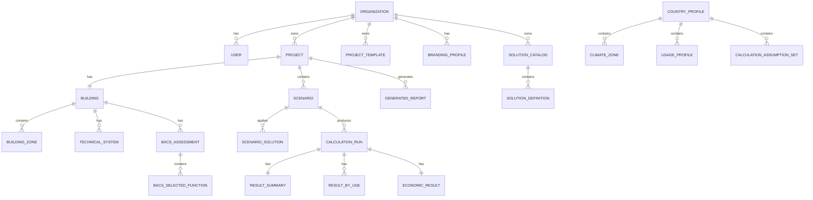

# 2. Modèle de données complet

## 2.1 Principes de modélisation

Le modèle doit répondre à 7 exigences :

1. **un projet contient un bâtiment et plusieurs scénarios**
2. **un scénario produit un jeu de résultats versionné**
3. **les hypothèses standard sont séparées des données saisies**
4. **les solutions sont cataloguées et réutilisables**
5. **les paramètres pays/climat sont mutualisés**
6. **les données doivent permettre l’audit et la traçabilité**
7. **le modèle doit supporter le multi-organisation et la marque blanche**

---

# 2.2 Vue conceptuelle globale

## Noyau métier

* `Organization`
* `User`
* `Project`
* `ProjectTemplate`
* `Building`
* `BuildingZone`
* `TechnicalSystem`
* `BacsAssessment`
* `Scenario`
* `ScenarioSolution`
* `CalculationRun`
* `ResultSummary`
* `ResultByUse`
* `EconomicResult`
* `GeneratedReport`

## Référentiels / configuration

* `CountryProfile`
* `ClimateZone`
* `UsageProfile`
* `SolutionCatalog`
* `SolutionDefinition`
* `BacsFunctionDefinition`
* `CalculationAssumptionSet`
* `BrandingProfile`

---

# 2.3 Diagramme entité-relation logique



---

# 2.4 Entités organisationnelles

## 2.4.1 Organization

Représente une entreprise cliente ou une entité exploitante/commerciale.

### Champs

* `id`
* `name`
* `slug`
* `default_language` (`fr`, `en`)
* `default_country_code`
* `is_active`
* `created_at`
* `updated_at`

### Usage

* cloisonnement des données
* rattachement des utilisateurs
* rattachement du branding
* catalogues spécifiques

---

## 2.4.2 User

### Champs

* `id`
* `organization_id`
* `email`
* `password_hash`
* `first_name`
* `last_name`
* `role`
  valeurs :

  * `super_admin`
  * `org_admin`
  * `commercial`
  * `operator`
  * `viewer`
* `preferred_language`
* `is_active`
* `last_login_at`
* `created_at`
* `updated_at`

---

## 2.4.3 BrandingProfile

Permet la marque blanche.

### Champs

* `id`
* `organization_id`
* `name`
* `logo_file_path`
* `primary_color`
* `secondary_color`
* `accent_color`
* `report_footer_text`
* `legal_notice_text`
* `report_cover_title`
* `report_cover_subtitle`
* `is_default`
* `created_at`
* `updated_at`

---

# 2.5 Entités projet

## 2.5.1 Project

Cœur fonctionnel.

### Champs

* `id`
* `organization_id`
* `created_by_user_id`
* `template_id` nullable
* `name`
* `reference_code`
* `description`
* `status`
  valeurs :

  * `draft`
  * `in_progress`
  * `completed`
  * `archived`
* `country_profile_id`
* `climate_zone_id`
* `branding_profile_id` nullable
* `building_type`
  valeurs :

  * `hotel`
  * `aparthotel`
  * `residence`
  * `other_accommodation`
* `client_name`
* `client_type`
* `project_goal`
* `wizard_step`
* `is_template_based`
* `created_at`
* `updated_at`
* `archived_at` nullable

### Remarques

`wizard_step` permet de reprendre la saisie là où elle s’est arrêtée.

---

## 2.5.2 ProjectTemplate

Modèle réutilisable.

### Champs

* `id`
* `organization_id`
* `name`
* `description`
* `building_type`
* `country_profile_id`
* `default_payload_json`
* `is_active`
* `created_by_user_id`
* `created_at`
* `updated_at`

### Remarque

`default_payload_json` peut contenir :

* hypothèses initiales,
* zoning de base,
* solutions fréquemment utilisées,
* branding par défaut.

---

# 2.6 Entités bâtiment

## 2.6.1 Building

Une seule fiche bâtiment par projet en V1.

### Champs

* `id`
* `project_id`
* `name`
* `construction_period`
  exemples :

  * `before_1975`
  * `1975_1990`
  * `1991_2005`
  * `2006_2012`
  * `after_2012`
* `year_of_construction` nullable
* `gross_floor_area_m2`
* `heated_area_m2`
* `cooled_area_m2`
* `number_of_floors`
* `number_of_rooms`
* `average_floor_height_m`
* `main_orientation`
* `compactness_level`
* `site_altitude_m` nullable
* `has_restaurant`
* `has_meeting_rooms`
* `has_spa`
* `has_pool`
* `notes`
* `created_at`
* `updated_at`

---

## 2.6.2 BuildingZone

Permet le zoning fonctionnel et d’orientation.

### Champs

* `id`
* `building_id`
* `name`
* `zone_type`
  valeurs :

  * `guest_rooms`
  * `circulation`
  * `lobby`
  * `restaurant`
  * `meeting`
  * `technical`
  * `spa`
  * `pool`
  * `other`
* `orientation`

  * `north`
  * `south`
  * `east`
  * `west`
  * `mixed`
* `floor_index` nullable
* `area_m2`
* `volume_m3` nullable
* `room_count` nullable
* `window_ratio`
* `occupancy_profile_id` nullable
* `heating_setpoint_c`
* `cooling_setpoint_c`
* `night_setback_enabled`
* `infiltration_level`
* `solar_exposure_level`
* `is_conditioned`
* `notes`
* `created_at`
* `updated_at`

### Intérêt

Permet par exemple :

* chambres Sud,
* chambres Nord,
* lobby,
* restaurant,
* salles de réunion.

---

# 2.7 Entités d’usage

## 2.7.1 UsageProfile

Profil standard de fonctionnement, mutualisé par pays.

### Champs

* `id`
* `country_profile_id`
* `code`
* `name_fr`
* `name_en`
* `building_type`
* `zone_type`
* `default_occupancy_rate`
* `seasonality_profile_json`
* `daily_schedule_json`
* `ecs_intensity_level`
* `lighting_intensity_level`
* `ventilation_intensity_level`
* `description`
* `is_default`
* `version`
* `created_at`
* `updated_at`

---

## 2.7.2 ProjectUsageOverride

Permet de surcharger les profils standard au niveau projet.

### Champs

* `id`
* `project_id`
* `building_zone_id` nullable
* `usage_profile_id`
* `occupancy_rate_override`
* `seasonality_profile_override_json`
* `daily_schedule_override_json`
* `ecs_intensity_override`
* `lighting_intensity_override`
* `notes`
* `created_at`
* `updated_at`

---

# 2.8 Entités systèmes techniques

## 2.8.1 TechnicalSystem

Une table générique pour tous les systèmes, avec spécialisation légère par type.

### Champs

* `id`
* `building_id`
* `system_type`

  * `heating`
  * `cooling`
  * `ventilation`
  * `dhw`
  * `lighting`
  * `auxiliaries`
  * `control`
* `name`
* `serves_zone_id` nullable
* `energy_source`

  * `electricity`
  * `gas`
  * `district_heating`
  * `oil`
  * `mixed`
  * `other`
* `technology_type`
* `efficiency_level`
* `distribution_type`
* `terminal_type`
* `control_level`
* `nominal_power_kw` nullable
* `operation_schedule_type`
* `age_band`
* `is_centralized`
* `notes`
* `created_at`
* `updated_at`

### Exemples

* chauffage central gaz,
* PAC air/eau,
* ventilation double flux,
* ECS centralisée,
* éclairage LED,
* GTB partielle.

---

# 2.9 Entités BACS

## 2.9.1 BacsAssessment

Évaluation de l’état actuel.

### Champs

* `id`
* `building_id`
* `assessment_scope`

  * `current`
  * `target`
* `assessment_method`

  * `questionnaire`
  * `manual`
  * `mixed`
* `estimated_bacs_class`

  * `A`
  * `B`
  * `C`
  * `D`
* `manual_override_class` nullable
* `final_bacs_class`
* `confidence_score` nullable
* `notes`
* `calculation_assumption_set_id`
* `created_at`
* `updated_at`

---

## 2.9.2 BacsFunctionDefinition

Référentiel des fonctions BACS.

### Champs

* `id`
* `country_profile_id` nullable
* `system_scope`

  * `heating`
  * `cooling`
  * `ventilation`
  * `dhw`
  * `lighting`
  * `monitoring`
  * `room_automation`
  * `supervision`
* `code`
* `name_fr`
* `name_en`
* `description_fr`
* `description_en`
* `default_bacs_impact_level`
* `energy_saving_factor_json`
* `comfort_impact`
* `co2_impact_level`
* `requires_prerequisite_json`
* `is_active`
* `version`
* `created_at`
* `updated_at`

### Exemples

* détection d’absence en chambre,
* arrêt chauffage sur fenêtre ouverte,
* programmation horaire,
* régulation pièce par pièce,
* supervision centralisée.

---

## 2.9.3 BacsSelectedFunction

Fonctions retenues dans une évaluation.

### Champs

* `id`
* `bacs_assessment_id`
* `bacs_function_definition_id`
* `status`

  * `present`
  * `absent`
  * `planned`
* `applies_to_zone_id` nullable
* `manual_gain_adjustment_percent` nullable
* `notes`
* `created_at`
* `updated_at`

---

# 2.10 Entités solutions

## 2.10.1 SolutionCatalog

Catalogue de solutions.

### Champs

* `id`
* `organization_id` nullable
* `country_profile_id` nullable
* `name`
* `scope_type`

  * `global`
  * `country_specific`
  * `organization_specific`
* `is_default`
* `version`
* `is_active`
* `created_at`
* `updated_at`

### Logique

* catalogue global plateforme,
* catalogue pays,
* catalogue entreprise.

---

## 2.10.2 SolutionDefinition

Définit une solution activable.

### Champs

* `id`
* `solution_catalog_id`
* `code`
* `name_fr`
* `name_en`
* `description_fr`
* `description_en`
* `solution_family`

  * `bacs`
  * `hvac`
  * `dhw`
  * `lighting`
  * `envelope`
  * `monitoring`
  * `other`
* `applicable_building_types_json`
* `applicable_zone_types_json`
* `applicable_country_codes_json`
* `default_energy_gain_model_json`
* `default_co2_gain_model_json`
* `default_capex_model_json`
* `default_maintenance_model_json`
* `default_lifetime_years`
* `default_bacs_class_impact_json`
* `priority_order`
* `is_commercial_offer`
* `offer_reference` nullable
* `is_active`
* `version`
* `created_at`
* `updated_at`

### Remarque

Les champs `*_model_json` permettent de stocker des règles simples :

* gain fixe,
* gain en fonction de zone,
* gain selon présence d’un système,
* gain conditionné par orientation.

---

## 2.10.3 ScenarioSolution

Associe des solutions à un scénario.

### Champs

* `id`
* `scenario_id`
* `solution_definition_id`
* `target_scope`

  * `building`
  * `zone`
  * `system`
* `target_zone_id` nullable
* `target_system_id` nullable
* `quantity`
* `unit_cost_override`
* `capex_override`
* `maintenance_override`
* `gain_override_percent`
* `is_selected`
* `notes`
* `created_at`
* `updated_at`

---

# 2.11 Entités scénarios

## 2.11.1 Scenario

Une variante calculable.

### Champs

* `id`
* `project_id`
* `name`
* `description`
* `scenario_type`

  * `baseline`
  * `improved`
  * `target_bacs`
  * `custom`
* `is_reference`
* `derived_from_scenario_id` nullable
* `status`

  * `draft`
  * `ready`
  * `calculated`
* `country_profile_id`
* `calculation_assumption_set_id`
* `notes`
* `created_at`
* `updated_at`

### Usage

* scénario initial,
* scénario “BACS chambres”,
* scénario “bouquet complet”.

---

# 2.12 Entités de calcul

## 2.12.1 CalculationAssumptionSet

Version d’hypothèses utilisées.

### Champs

* `id`
* `country_profile_id`
* `name`
* `version`
* `scope`

  * `platform_default`
  * `country_default`
  * `organization_override`
* `heating_model_json`
* `cooling_model_json`
* `ventilation_model_json`
* `dhw_model_json`
* `lighting_model_json`
* `auxiliaries_model_json`
* `economic_defaults_json`
* `bacs_rules_json`
* `co2_factors_json`
* `notes`
* `is_active`
* `created_at`
* `updated_at`

---

## 2.12.2 CalculationRun

Chaque exécution du moteur.

### Champs

* `id`
* `scenario_id`
* `run_status`

  * `pending`
  * `running`
  * `completed`
  * `failed`
* `engine_version`
* `assumption_set_version`
* `solution_catalog_version_snapshot`
* `started_at`
* `finished_at`
* `input_snapshot_json`
* `warnings_json`
* `errors_json`
* `triggered_by_user_id`
* `created_at`

### Importance

Permet l’audit complet du calcul.

---

## 2.12.3 ResultSummary

Résumé global de sortie.

### Champs

* `id`
* `calculation_run_id`
* `baseline_energy_kwh_year`
* `scenario_energy_kwh_year`
* `energy_savings_kwh_year`
* `energy_savings_percent`
* `baseline_energy_intensity_kwh_m2`
* `scenario_energy_intensity_kwh_m2`
* `baseline_co2_kg_year`
* `scenario_co2_kg_year`
* `co2_savings_kg_year`
* `co2_savings_percent`
* `baseline_bacs_class`
* `scenario_bacs_class`
* `comfort_score_delta`
* `global_project_score`
* `created_at`

---

## 2.12.4 ResultByUse

Détail par usage.

### Champs

* `id`
* `calculation_run_id`
* `use_type`

  * `heating`
  * `cooling`
  * `ventilation`
  * `dhw`
  * `lighting`
  * `auxiliaries`
* `baseline_kwh_year`
* `scenario_kwh_year`
* `savings_kwh_year`
* `savings_percent`
* `co2_baseline_kg_year`
* `co2_scenario_kg_year`
* `created_at`

---

## 2.12.5 ResultByZone

Détail par zone, très utile commercialement.

### Champs

* `id`
* `calculation_run_id`
* `building_zone_id`
* `baseline_kwh_year`
* `scenario_kwh_year`
* `savings_kwh_year`
* `savings_percent`
* `main_gain_driver`
* `created_at`

---

## 2.12.6 EconomicResult

Sortie économique consolidée.

### Champs

* `id`
* `calculation_run_id`
* `total_capex`
* `annual_energy_cost_before`
* `annual_energy_cost_after`
* `annual_cost_savings`
* `annual_maintenance_before`
* `annual_maintenance_after`
* `annual_maintenance_savings`
* `simple_payback_years`
* `npv`
* `irr`
* `discount_rate`
* `energy_inflation_rate`
* `analysis_period_years`
* `subsidies_amount`
* `replacement_costs_json`
* `cashflow_json`
* `created_at`

---

# 2.13 Entités rapport

## 2.13.1 GeneratedReport

### Champs

* `id`
* `project_id`
* `scenario_id` nullable
* `calculation_run_id`
* `report_type`

  * `executive`
  * `detailed`
* `language`
* `branding_profile_id`
* `file_path`
* `file_size_bytes`
* `generation_status`

  * `pending`
  * `generated`
  * `failed`
* `generated_by_user_id`
* `generated_at`
* `metadata_json`

---

# 2.14 Entités pays et climat

## 2.14.1 CountryProfile

### Champs

* `id`
* `country_code`
* `name_fr`
* `name_en`
* `regulatory_scope`

  * `france_specific`
  * `eu_generic`
* `currency_code`
* `default_language`
* `default_discount_rate`
* `default_energy_inflation_rate`
* `default_analysis_period_years`
* `electricity_co2_factor`
* `gas_co2_factor`
* `regulatory_text_fr`
* `regulatory_text_en`
* `is_active`
* `created_at`
* `updated_at`

---

## 2.14.2 ClimateZone

### Champs

* `id`
* `country_profile_id`
* `code`
* `name_fr`
* `name_en`
* `heating_severity_index`
* `cooling_severity_index`
* `solar_exposure_index`
* `default_weather_profile_json`
* `is_default`
* `created_at`
* `updated_at`

---

# 2.15 Tables d’audit et de gouvernance

## 2.15.1 AuditLog

### Champs

* `id`
* `organization_id`
* `user_id`
* `entity_type`
* `entity_id`
* `action`

  * `create`
  * `update`
  * `delete`
  * `calculate`
  * `generate_report`
  * `login`
* `before_json`
* `after_json`
* `created_at`

---

# 2.16 Relations métier clés

## Relations obligatoires

* 1 organisation → N projets
* 1 projet → 1 bâtiment
* 1 bâtiment → N zones
* 1 projet → N scénarios
* 1 scénario → N solutions appliquées
* 1 scénario → N calculs
* 1 calcul → 1 résumé + N résultats détaillés

## Relations optionnelles

* 1 projet → 0..N rapports
* 1 zone → 0..N systèmes
* 1 évaluation BACS → N fonctions

---

# 2.17 Choix de normalisation

## À normaliser strictement

* utilisateurs
* projets
* bâtiments
* zones
* scénarios
* solutions
* calculs
* rapports

## À garder semi-flexible via JSONB

* snapshots d’entrée
* profils horaires
* saisonnalité
* modèles de gain
* cash-flows détaillés
* avertissements calcul

C’est le bon compromis.

---

# 2.18 Exemple de structure SQL simplifiée

## Table `projects`

```sql
CREATE TABLE projects (
    id UUID PRIMARY KEY,
    organization_id UUID NOT NULL REFERENCES organizations(id),
    created_by_user_id UUID NOT NULL REFERENCES users(id),
    template_id UUID NULL REFERENCES project_templates(id),
    name VARCHAR(255) NOT NULL,
    reference_code VARCHAR(100),
    description TEXT,
    status VARCHAR(50) NOT NULL DEFAULT 'draft',
    country_profile_id UUID NOT NULL REFERENCES country_profiles(id),
    climate_zone_id UUID NOT NULL REFERENCES climate_zones(id),
    branding_profile_id UUID NULL REFERENCES branding_profiles(id),
    building_type VARCHAR(50) NOT NULL,
    client_name VARCHAR(255),
    client_type VARCHAR(100),
    project_goal TEXT,
    wizard_step INTEGER NOT NULL DEFAULT 1,
    is_template_based BOOLEAN NOT NULL DEFAULT FALSE,
    created_at TIMESTAMP NOT NULL DEFAULT NOW(),
    updated_at TIMESTAMP NOT NULL DEFAULT NOW(),
    archived_at TIMESTAMP NULL
);
```

## Table `building_zones`

```sql
CREATE TABLE building_zones (
    id UUID PRIMARY KEY,
    building_id UUID NOT NULL REFERENCES buildings(id),
    name VARCHAR(255) NOT NULL,
    zone_type VARCHAR(50) NOT NULL,
    orientation VARCHAR(20) NOT NULL,
    floor_index INTEGER,
    area_m2 NUMERIC(12,2) NOT NULL,
    volume_m3 NUMERIC(12,2),
    room_count INTEGER,
    window_ratio NUMERIC(5,2),
    occupancy_profile_id UUID NULL REFERENCES usage_profiles(id),
    heating_setpoint_c NUMERIC(5,2),
    cooling_setpoint_c NUMERIC(5,2),
    night_setback_enabled BOOLEAN NOT NULL DEFAULT FALSE,
    infiltration_level VARCHAR(50),
    solar_exposure_level VARCHAR(50),
    is_conditioned BOOLEAN NOT NULL DEFAULT TRUE,
    notes TEXT,
    created_at TIMESTAMP NOT NULL DEFAULT NOW(),
    updated_at TIMESTAMP NOT NULL DEFAULT NOW()
);
```

---

# 2.19 Snapshots indispensables

Pour garantir la reproductibilité, chaque `CalculationRun` doit embarquer un snapshot :

* des données du projet,
* des zones,
* des systèmes,
* du BACS,
* des solutions,
* des hypothèses,
* du contexte pays/climat.

Ainsi, même si un catalogue ou un coefficient change plus tard, on peut toujours réexpliquer un ancien rapport.

---

# 2.20 Décisions de modélisation que je recommande de figer

Je recommande de figer ces choix :

* **1 bâtiment par projet** en V1
* **zones orientées** dans `BuildingZone`
* **systèmes techniques génériques** avec `system_type`
* **BACS en questionnaire + fonctions élémentaires**
* **catalogues versionnés**
* **calculs historisés**
* **résultats globaux + par usage + par zone**
* **rapport rattaché à un calcul précis**
* **profils pays/climat séparés**
* **JSONB pour les modèles avancés**

---

