# Description detaillee de la base de donnees

Horodatage : 2026-04-13 19:05:25 +02:00

Ce document decrit la base de donnees telle qu'elle est implementee dans les modeles SQLAlchemy du backend au moment de l'horodatage ci-dessus. Les sources utilisees sont `backend/app/db/models/*`, `backend/app/db/base.py`, `backend/tests/test_db_metadata.py` et les migrations Alembic de `backend/migrations/versions`.

Note importante : certains champs UUID sont utilises comme references applicatives sans contrainte `ForeignKey` dans le modele SQLAlchemy actuel, notamment `projects.country_profile_id`, `projects.climate_zone_id`, `calculation_assumption_sets.country_profile_id`, `calculation_assumption_sets.cloned_from_id`, `scenarios.derived_from_scenario_id`, `scenario_solution_assignments.target_zone_id`, `scenario_solution_assignments.target_system_id` et `result_by_zone.zone_id`.

## Vue generale

La base est organisee autour d'un noyau multi-organisation : `organizations` possede les utilisateurs, les projets, les profils de marque, les jeux d'hypotheses, les catalogues de solutions et les modeles de projet. Un projet porte ensuite la description du batiment, les zones, les systemes, l'evaluation BACS, les scenarios, les calculs, les resultats et les rapports generes.

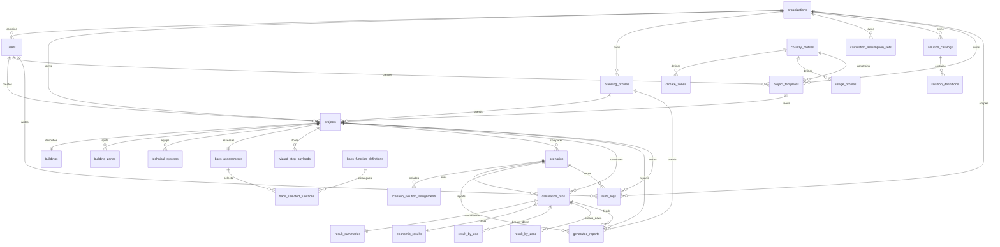
```mermaid
erDiagram
    organizations ||--o{ users : contains
    organizations ||--o{ projects : owns
    organizations ||--o{ branding_profiles : owns
    organizations ||--o{ calculation_assumption_sets : owns
    organizations ||--o{ solution_catalogs : owns
    organizations ||--o{ project_templates : owns
    organizations ||--o{ audit_logs : scopes
    users ||--o{ projects : creates
    users ||--o{ project_templates : creates
    users ||--o{ audit_logs : writes
    country_profiles ||--o{ climate_zones : defines
    country_profiles ||--o{ usage_profiles : defines
    country_profiles ||--o{ project_templates : constrains
    branding_profiles ||--o{ projects : brands
    branding_profiles ||--o{ generated_reports : brands
    project_templates ||--o{ projects : seeds
    projects ||--|| buildings : describes
    projects ||--o{ building_zones : splits
    projects ||--o{ technical_systems : equips
    projects ||--|| bacs_assessments : assesses
    projects ||--o{ wizard_step_payloads : stores
    projects ||--o{ scenarios : compares
    projects ||--o{ calculation_runs : calculates
    projects ||--o{ generated_reports : reports
    projects ||--o{ audit_logs : traces
    bacs_assessments ||--o{ bacs_selected_functions : selects
    bacs_function_definitions ||--o{ bacs_selected_functions : catalogues
    scenarios ||--o{ scenario_solution_assignments : includes
    scenarios ||--o{ calculation_runs : runs
    scenarios ||--o{ generated_reports : reports
    scenarios ||--o{ audit_logs : traces
    solution_catalogs ||--o{ solution_definitions : contains
    calculation_runs ||--|| result_summaries : summarizes
    calculation_runs ||--|| economic_results : costs
    calculation_runs ||--o{ result_by_use : breaks_down
    calculation_runs ||--o{ result_by_zone : breaks_down
    calculation_runs ||--o{ generated_reports : feeds
```

## `organizations`

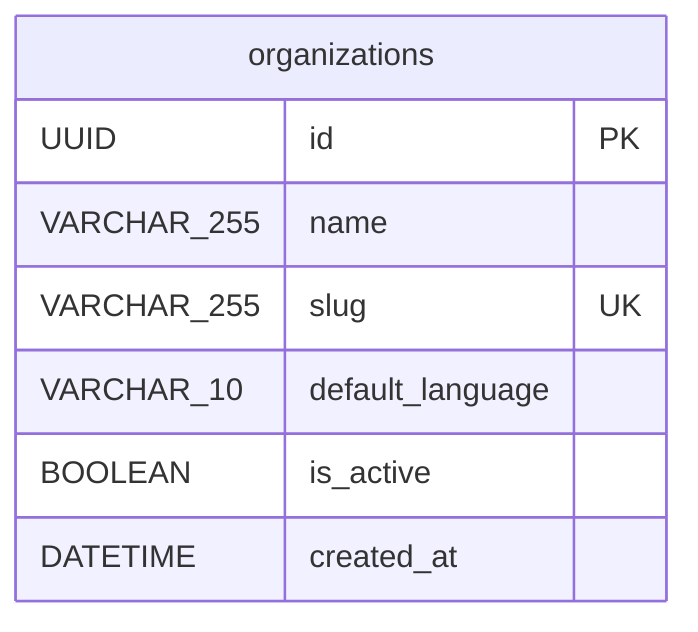
```mermaid
erDiagram
    organizations {
        UUID id PK
        VARCHAR_255 name
        VARCHAR_255 slug UK
        VARCHAR_10 default_language
        BOOLEAN is_active
        DATETIME created_at
    }
```

`organizations` represente le tenant fonctionnel. Elle sert de racine d'isolation pour les utilisateurs, projets, profils de marque, jeux d'hypotheses et catalogues propres a une organisation.

| Champ | Description |
| --- | --- |
| `id` | Identifiant UUID primaire, genere par l'application. |
| `name` | Nom lisible de l'organisation. Obligatoire. |
| `slug` | Identifiant court unique de l'organisation. Obligatoire et unique. |
| `default_language` | Langue par defaut de l'organisation. Obligatoire, valeur serveur par defaut `'fr'`. |
| `is_active` | Indique si l'organisation est active. Obligatoire, valeur serveur par defaut `true`. |
| `created_at` | Date de creation timezone-aware. Obligatoire, valeur applicative courante et valeur serveur `CURRENT_TIMESTAMP`. |

## `users`

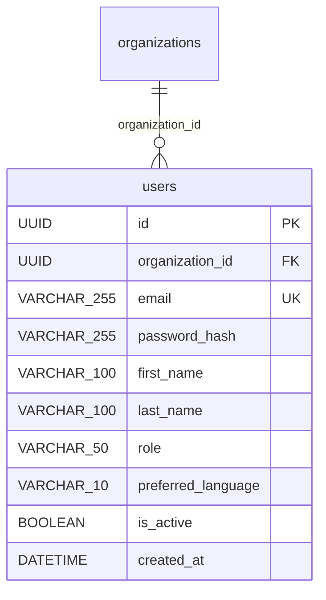
```mermaid
erDiagram
    users {
        UUID id PK
        UUID organization_id FK
        VARCHAR_255 email UK
        VARCHAR_255 password_hash
        VARCHAR_100 first_name
        VARCHAR_100 last_name
        VARCHAR_50 role
        VARCHAR_10 preferred_language
        BOOLEAN is_active
        DATETIME created_at
    }
    organizations ||--o{ users : organization_id
```

`users` stocke les comptes applicatifs rattaches a une organisation. La table porte l'authentification de base, le role et les preferences linguistiques.

| Champ | Description |
| --- | --- |
| `id` | Identifiant UUID primaire, genere par l'application. |
| `organization_id` | Reference obligatoire vers `organizations.id`, suppression en cascade. |
| `email` | Adresse email de connexion. Obligatoire et unique. |
| `password_hash` | Empreinte du mot de passe. Obligatoire. |
| `first_name` | Prenom optionnel. |
| `last_name` | Nom optionnel. |
| `role` | Role applicatif de l'utilisateur, stocke en chaine. Obligatoire. |
| `preferred_language` | Langue preferee. Obligatoire, valeur serveur par defaut `'fr'`. |
| `is_active` | Statut actif/inactif du compte. Obligatoire, valeur serveur par defaut `true`. |
| `created_at` | Date de creation timezone-aware. Obligatoire, valeur applicative courante et valeur serveur `CURRENT_TIMESTAMP`. |

## `country_profiles`

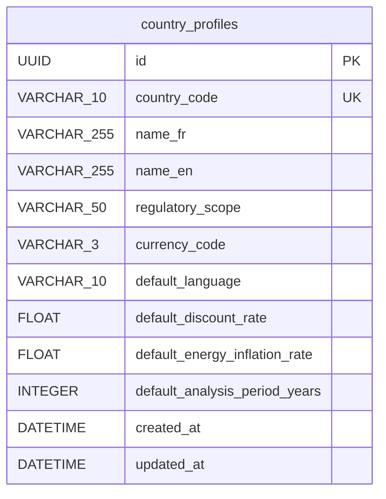
```mermaid
erDiagram
    country_profiles {
        UUID id PK
        VARCHAR_10 country_code UK
        VARCHAR_255 name_fr
        VARCHAR_255 name_en
        VARCHAR_50 regulatory_scope
        VARCHAR_3 currency_code
        VARCHAR_10 default_language
        FLOAT default_discount_rate
        FLOAT default_energy_inflation_rate
        INTEGER default_analysis_period_years
        DATETIME created_at
        DATETIME updated_at
    }
```

`country_profiles` contient les parametres pays de haut niveau : devise, langue par defaut, portee reglementaire indicative et valeurs economiques par defaut.

| Champ | Description |
| --- | --- |
| `id` | Identifiant UUID primaire, genere par l'application. |
| `country_code` | Code pays, par exemple `FR`. Obligatoire et unique via `uq_country_profiles_country_code`. |
| `name_fr` | Nom du pays en francais. Obligatoire. |
| `name_en` | Nom du pays en anglais. Obligatoire. |
| `regulatory_scope` | Libelle de portee reglementaire ou de contexte pays. Obligatoire. |
| `currency_code` | Code devise ISO sur trois caracteres. Obligatoire. |
| `default_language` | Langue par defaut du profil pays. Obligatoire, valeur serveur par defaut `'fr'`. |
| `default_discount_rate` | Taux d'actualisation par defaut. Obligatoire. |
| `default_energy_inflation_rate` | Taux d'inflation energie par defaut. Obligatoire. |
| `default_analysis_period_years` | Duree d'analyse economique par defaut, en annees. Obligatoire. |
| `created_at` | Date de creation timezone-aware. Obligatoire, valeur applicative courante et valeur serveur `CURRENT_TIMESTAMP`. |
| `updated_at` | Date de derniere mise a jour timezone-aware. Obligatoire, mise a jour applicative et valeur serveur `CURRENT_TIMESTAMP`. |

## `solution_catalogs`

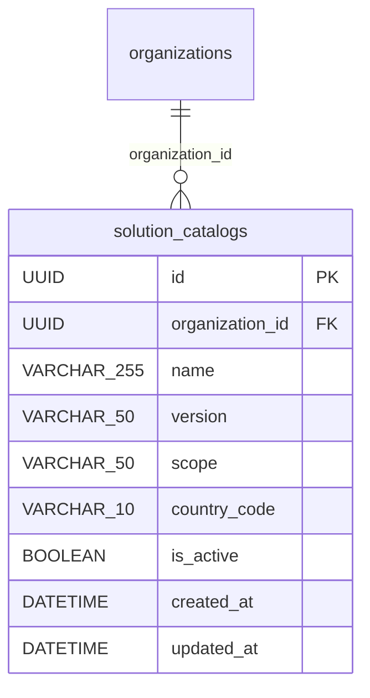
```mermaid
erDiagram
    solution_catalogs {
        UUID id PK
        UUID organization_id FK
        VARCHAR_255 name
        VARCHAR_50 version
        VARCHAR_50 scope
        VARCHAR_10 country_code
        BOOLEAN is_active
        DATETIME created_at
        DATETIME updated_at
    }
    organizations ||--o{ solution_catalogs : organization_id
```

`solution_catalogs` regroupe des definitions de solutions. Le catalogue peut etre global si `organization_id` est nul ou specifique a une organisation s'il est renseigne.

| Champ | Description |
| --- | --- |
| `id` | Identifiant UUID primaire, genere par l'application. |
| `organization_id` | Reference optionnelle vers `organizations.id`, suppression en cascade. Nul pour un catalogue non rattache a une organisation. |
| `name` | Nom du catalogue. Obligatoire. |
| `version` | Version du catalogue. Obligatoire. |
| `scope` | Portee du catalogue, stockee en chaine. Obligatoire. |
| `country_code` | Code pays optionnel du catalogue. |
| `is_active` | Indique si le catalogue est actif. Obligatoire, valeur applicative et serveur `true`. |
| `created_at` | Date de creation timezone-aware. Obligatoire, valeur applicative courante et valeur serveur `CURRENT_TIMESTAMP`. |
| `updated_at` | Date de derniere mise a jour timezone-aware. Obligatoire, mise a jour applicative et valeur serveur `CURRENT_TIMESTAMP`. |

## `solution_definitions`

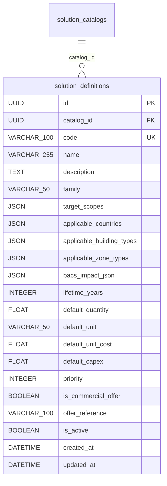
```mermaid
erDiagram
    solution_definitions {
        UUID id PK
        UUID catalog_id FK
        VARCHAR_100 code UK
        VARCHAR_255 name
        TEXT description
        VARCHAR_50 family
        JSON target_scopes
        JSON applicable_countries
        JSON applicable_building_types
        JSON applicable_zone_types
        JSON bacs_impact_json
        INTEGER lifetime_years
        FLOAT default_quantity
        VARCHAR_50 default_unit
        FLOAT default_unit_cost
        FLOAT default_capex
        INTEGER priority
        BOOLEAN is_commercial_offer
        VARCHAR_100 offer_reference
        BOOLEAN is_active
        DATETIME created_at
        DATETIME updated_at
    }
    solution_catalogs ||--o{ solution_definitions : catalog_id
```

`solution_definitions` contient les actions d'amelioration disponibles pour les scenarios : metadonnees commerciales, applicabilite, hypotheses de cout et impacts BACS.

| Champ | Description |
| --- | --- |
| `id` | Identifiant UUID primaire, genere par l'application. |
| `catalog_id` | Reference obligatoire vers `solution_catalogs.id`, suppression en cascade. |
| `code` | Code unique de solution. Obligatoire et unique. |
| `name` | Nom de la solution. Obligatoire. |
| `description` | Description de la solution. Obligatoire. |
| `family` | Famille de solution. Obligatoire. |
| `target_scopes` | Perimetres cibles acceptes au format JSON. Obligatoire, valeur applicative par defaut `[]`. |
| `applicable_countries` | Pays applicables au format JSON. Obligatoire, valeur applicative par defaut `[]`. |
| `applicable_building_types` | Types de batiment applicables au format JSON. Obligatoire, valeur applicative par defaut `[]`. |
| `applicable_zone_types` | Types de zone applicables au format JSON. Obligatoire, valeur applicative par defaut `[]`. |
| `bacs_impact_json` | Description JSON de l'impact BACS. Obligatoire, valeur applicative par defaut `{}`. |
| `lifetime_years` | Duree de vie de la solution en annees. Optionnelle. |
| `default_quantity` | Quantite par defaut. Optionnelle. |
| `default_unit` | Unite par defaut. Optionnelle. |
| `default_unit_cost` | Cout unitaire par defaut. Optionnel. |
| `default_capex` | CAPEX par defaut. Optionnel. |
| `priority` | Priorite d'affichage ou de proposition. Obligatoire, valeur applicative par defaut `100`. |
| `is_commercial_offer` | Indique si la solution correspond a une offre commerciale. Obligatoire, valeur applicative et serveur `false`. |
| `offer_reference` | Reference commerciale optionnelle. |
| `is_active` | Indique si la solution est active. Obligatoire, valeur applicative et serveur `true`. |
| `created_at` | Date de creation timezone-aware. Obligatoire, valeur applicative courante et valeur serveur `CURRENT_TIMESTAMP`. |
| `updated_at` | Date de derniere mise a jour timezone-aware. Obligatoire, mise a jour applicative et valeur serveur `CURRENT_TIMESTAMP`. |

## `buildings`

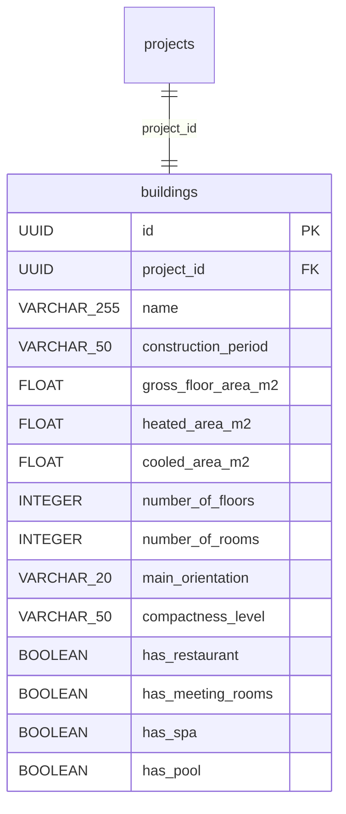
```mermaid
erDiagram
    buildings {
        UUID id PK
        UUID project_id FK
        VARCHAR_255 name
        VARCHAR_50 construction_period
        FLOAT gross_floor_area_m2
        FLOAT heated_area_m2
        FLOAT cooled_area_m2
        INTEGER number_of_floors
        INTEGER number_of_rooms
        VARCHAR_20 main_orientation
        VARCHAR_50 compactness_level
        BOOLEAN has_restaurant
        BOOLEAN has_meeting_rooms
        BOOLEAN has_spa
        BOOLEAN has_pool
    }
    projects ||--|| buildings : project_id
```

`buildings` stocke la fiche batiment principale d'un projet. La relation est un-pour-un avec `projects`.

| Champ | Description |
| --- | --- |
| `id` | Identifiant UUID primaire, genere par l'application. |
| `project_id` | Reference obligatoire et unique vers `projects.id`, suppression en cascade. |
| `name` | Nom optionnel du batiment. |
| `construction_period` | Periode de construction, stockee en chaine. Optionnelle. |
| `gross_floor_area_m2` | Surface brute totale en metres carres. Optionnelle. |
| `heated_area_m2` | Surface chauffee en metres carres. Optionnelle. |
| `cooled_area_m2` | Surface refroidie en metres carres. Optionnelle. |
| `number_of_floors` | Nombre d'etages. Optionnel. |
| `number_of_rooms` | Nombre de chambres/logements. Optionnel. |
| `main_orientation` | Orientation principale du batiment. Optionnelle. |
| `compactness_level` | Niveau de compacite du batiment. Optionnel. |
| `has_restaurant` | Presence d'un restaurant. Obligatoire, valeur applicative par defaut `false`. |
| `has_meeting_rooms` | Presence de salles de reunion. Obligatoire, valeur applicative par defaut `false`. |
| `has_spa` | Presence d'un spa. Obligatoire, valeur applicative par defaut `false`. |
| `has_pool` | Presence d'une piscine. Obligatoire, valeur applicative par defaut `false`. |

## `building_zones`

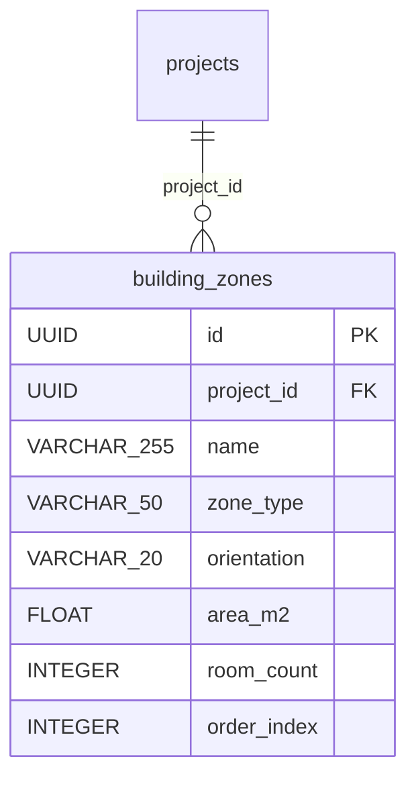
```mermaid
erDiagram
    building_zones {
        UUID id PK
        UUID project_id FK
        VARCHAR_255 name
        VARCHAR_50 zone_type
        VARCHAR_20 orientation
        FLOAT area_m2
        INTEGER room_count
        INTEGER order_index
    }
    projects ||--o{ building_zones : project_id
```

`building_zones` decompose le projet en zones fonctionnelles et orientees. Cette table porte un des differenciateurs principaux du produit : comparaison par fonction et orientation.

| Champ | Description |
| --- | --- |
| `id` | Identifiant UUID primaire, genere par l'application. |
| `project_id` | Reference obligatoire vers `projects.id`, suppression en cascade. |
| `name` | Nom de la zone. Obligatoire. |
| `zone_type` | Type fonctionnel de zone. Obligatoire. |
| `orientation` | Orientation de la zone. Obligatoire, valeur applicative par defaut `mixed`. |
| `area_m2` | Surface de la zone en metres carres. Obligatoire. |
| `room_count` | Nombre de chambres/logements dans la zone. Obligatoire, valeur applicative par defaut `0`. |
| `order_index` | Ordre d'affichage ou de traitement. Obligatoire, valeur applicative par defaut `0`. |

## `technical_systems`

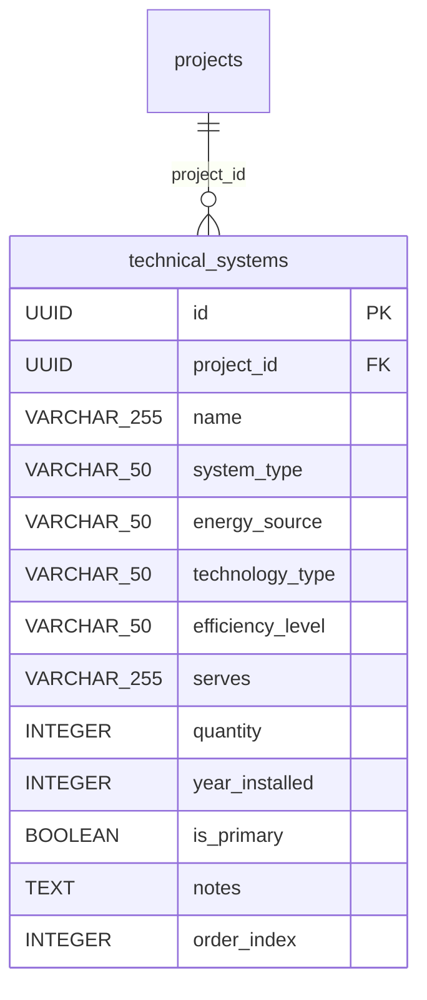
```mermaid
erDiagram
    technical_systems {
        UUID id PK
        UUID project_id FK
        VARCHAR_255 name
        VARCHAR_50 system_type
        VARCHAR_50 energy_source
        VARCHAR_50 technology_type
        VARCHAR_50 efficiency_level
        VARCHAR_255 serves
        INTEGER quantity
        INTEGER year_installed
        BOOLEAN is_primary
        TEXT notes
        INTEGER order_index
    }
    projects ||--o{ technical_systems : project_id
```

`technical_systems` decrit les systemes techniques d'un projet : chauffage, refroidissement, ECS, ventilation, eclairage ou autres familles utilisees par l'application.

| Champ | Description |
| --- | --- |
| `id` | Identifiant UUID primaire, genere par l'application. |
| `project_id` | Reference obligatoire vers `projects.id`, suppression en cascade. |
| `name` | Nom du systeme. Obligatoire. |
| `system_type` | Type de systeme. Obligatoire. |
| `energy_source` | Source d'energie. Optionnelle. |
| `technology_type` | Technologie ou famille technique. Optionnelle. |
| `efficiency_level` | Niveau d'efficacite. Optionnel. |
| `serves` | Zone, usage ou perimetre desservi sous forme textuelle. Optionnel. |
| `quantity` | Quantite d'equipements ou d'unites. Optionnelle. |
| `year_installed` | Annee d'installation. Optionnelle. |
| `is_primary` | Indique si le systeme est principal. Obligatoire, valeur applicative par defaut `false`. |
| `notes` | Notes libres. Optionnelles. |
| `order_index` | Ordre d'affichage ou de traitement. Obligatoire, valeur applicative par defaut `0`. |

## `wizard_step_payloads`

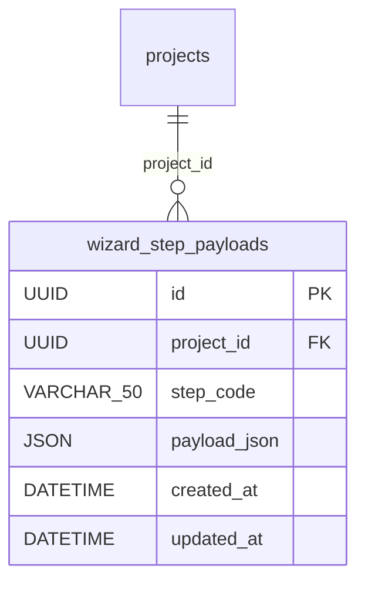
```mermaid
erDiagram
    wizard_step_payloads {
        UUID id PK
        UUID project_id FK
        VARCHAR_50 step_code
        JSON payload_json
        DATETIME created_at
        DATETIME updated_at
    }
    projects ||--o{ wizard_step_payloads : project_id
```

`wizard_step_payloads` conserve les donnees brutes par etape du wizard. Elle permet de garder une trace structuree des saisies express ou avancees, independamment des tables metier specialisees.

| Champ | Description |
| --- | --- |
| `id` | Identifiant UUID primaire, genere par l'application. |
| `project_id` | Reference obligatoire vers `projects.id`, suppression en cascade. |
| `step_code` | Code de l'etape du wizard. Obligatoire. Unique avec `project_id` via `uq_wizard_step_payloads_project_step`. |
| `payload_json` | Payload de saisie de l'etape au format JSON. Obligatoire, valeur applicative par defaut `{}`. |
| `created_at` | Date de creation timezone-aware. Obligatoire, valeur applicative courante et valeur serveur `CURRENT_TIMESTAMP`. |
| `updated_at` | Date de derniere mise a jour timezone-aware. Obligatoire, mise a jour applicative et valeur serveur `CURRENT_TIMESTAMP`. |

## `bacs_function_definitions`

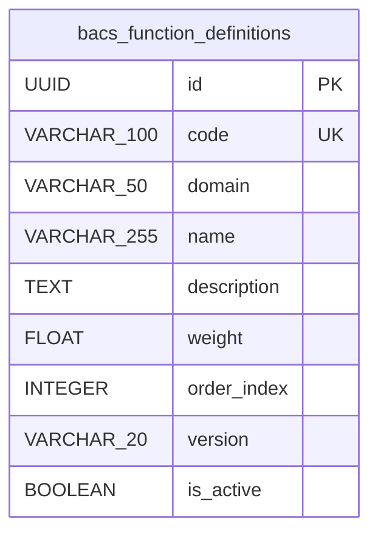
```mermaid
erDiagram
    bacs_function_definitions {
        UUID id PK
        VARCHAR_100 code UK
        VARCHAR_50 domain
        VARCHAR_255 name
        TEXT description
        FLOAT weight
        INTEGER order_index
        VARCHAR_20 version
        BOOLEAN is_active
    }
```

`bacs_function_definitions` est le catalogue des fonctions BACS disponibles pour l'evaluation. Chaque fonction possede un poids, un domaine, une version et un statut actif.

| Champ | Description |
| --- | --- |
| `id` | Identifiant UUID primaire, genere par l'application. |
| `code` | Code unique de fonction BACS. Obligatoire et unique. |
| `domain` | Domaine fonctionnel de la fonction BACS. Obligatoire. |
| `name` | Nom de la fonction. Obligatoire. |
| `description` | Description optionnelle. |
| `weight` | Poids de la fonction dans le scoring BACS simplifie. Obligatoire. |
| `order_index` | Ordre d'affichage. Obligatoire, valeur applicative par defaut `0`. |
| `version` | Version du catalogue ou de la regle. Obligatoire, valeur applicative par defaut `v1`. |
| `is_active` | Indique si la fonction est disponible. Obligatoire, valeur applicative par defaut `true`. |

## `bacs_assessments`

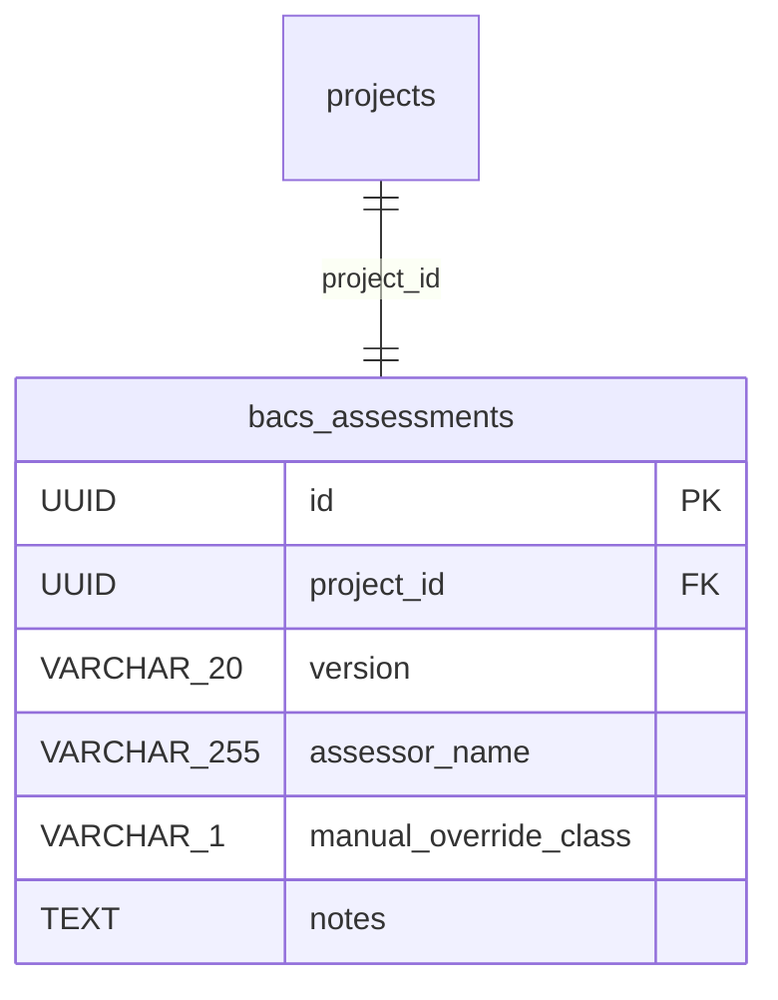
```mermaid
erDiagram
    bacs_assessments {
        UUID id PK
        UUID project_id FK
        VARCHAR_20 version
        VARCHAR_255 assessor_name
        VARCHAR_1 manual_override_class
        TEXT notes
    }
    projects ||--|| bacs_assessments : project_id
```

`bacs_assessments` stocke l'evaluation BACS d'un projet. La relation est un-pour-un avec `projects` et les fonctions selectionnees sont stockees dans une table de liaison.

| Champ | Description |
| --- | --- |
| `id` | Identifiant UUID primaire, genere par l'application. |
| `project_id` | Reference obligatoire et unique vers `projects.id`, suppression en cascade. |
| `version` | Version de l'evaluation. Obligatoire, valeur applicative par defaut `v1`. |
| `assessor_name` | Nom de l'evaluateur. Optionnel. |
| `manual_override_class` | Classe BACS forcee manuellement, stockee sur un caractere. Optionnelle. |
| `notes` | Notes libres de l'evaluation. Optionnelles. |

## `bacs_selected_functions`

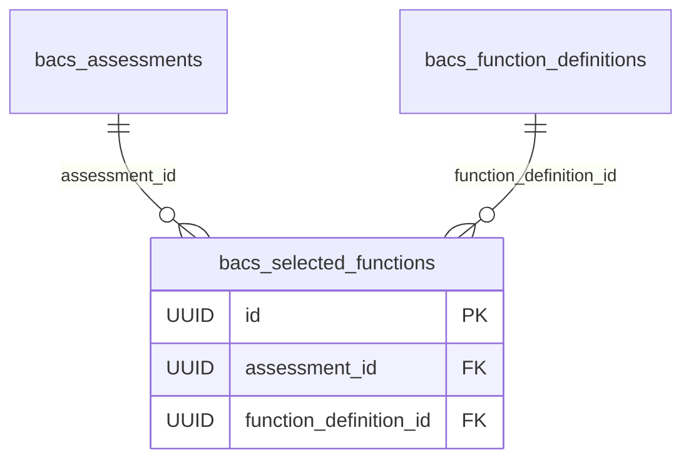
```mermaid
erDiagram
    bacs_selected_functions {
        UUID id PK
        UUID assessment_id FK
        UUID function_definition_id FK
    }
    bacs_assessments ||--o{ bacs_selected_functions : assessment_id
    bacs_function_definitions ||--o{ bacs_selected_functions : function_definition_id
```

`bacs_selected_functions` est la table de liaison entre une evaluation BACS et les fonctions BACS retenues. Elle evite la selection en doublon d'une meme fonction pour une meme evaluation.

| Champ | Description |
| --- | --- |
| `id` | Identifiant UUID primaire, genere par l'application. |
| `assessment_id` | Reference obligatoire vers `bacs_assessments.id`, suppression en cascade. Unique avec `function_definition_id` via `uq_bacs_selected_functions_assessment_function`. |
| `function_definition_id` | Reference obligatoire vers `bacs_function_definitions.id`, suppression en cascade. Unique avec `assessment_id` via `uq_bacs_selected_functions_assessment_function`. |

## `climate_zones`

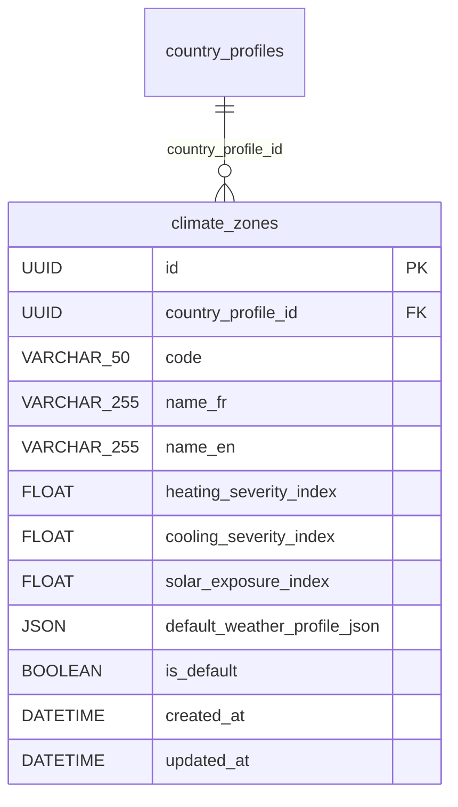
```mermaid
erDiagram
    climate_zones {
        UUID id PK
        UUID country_profile_id FK
        VARCHAR_50 code
        VARCHAR_255 name_fr
        VARCHAR_255 name_en
        FLOAT heating_severity_index
        FLOAT cooling_severity_index
        FLOAT solar_exposure_index
        JSON default_weather_profile_json
        BOOLEAN is_default
        DATETIME created_at
        DATETIME updated_at
    }
    country_profiles ||--o{ climate_zones : country_profile_id
```

`climate_zones` decrit les zones climatiques disponibles dans un pays. Ces donnees alimentent le moteur simplifie via des indices de chauffage, refroidissement et exposition solaire.

| Champ | Description |
| --- | --- |
| `id` | Identifiant UUID primaire, genere par l'application. |
| `country_profile_id` | Reference obligatoire vers `country_profiles.id`, suppression en cascade. |
| `code` | Code de zone climatique. Obligatoire. Unique avec `country_profile_id` via `uq_climate_zones_country_code`. |
| `name_fr` | Nom francais de la zone. Obligatoire. |
| `name_en` | Nom anglais de la zone. Obligatoire. |
| `heating_severity_index` | Indice de severite chauffage. Obligatoire. |
| `cooling_severity_index` | Indice de severite refroidissement. Obligatoire. |
| `solar_exposure_index` | Indice d'exposition solaire. Obligatoire. |
| `default_weather_profile_json` | Profil meteo simplifie au format JSON. Obligatoire, valeur applicative par defaut `{}`. |
| `is_default` | Indique la zone climatique par defaut du pays. Obligatoire, valeur applicative et serveur `false`. |
| `created_at` | Date de creation timezone-aware. Obligatoire, valeur applicative courante et valeur serveur `CURRENT_TIMESTAMP`. |
| `updated_at` | Date de derniere mise a jour timezone-aware. Obligatoire, mise a jour applicative et valeur serveur `CURRENT_TIMESTAMP`. |

## `usage_profiles`

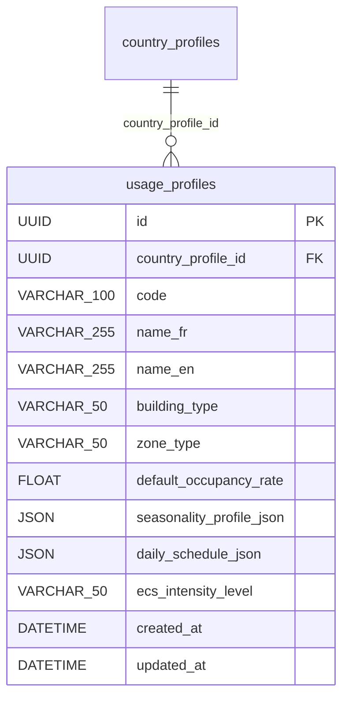
```mermaid
erDiagram
    usage_profiles {
        UUID id PK
        UUID country_profile_id FK
        VARCHAR_100 code
        VARCHAR_255 name_fr
        VARCHAR_255 name_en
        VARCHAR_50 building_type
        VARCHAR_50 zone_type
        FLOAT default_occupancy_rate
        JSON seasonality_profile_json
        JSON daily_schedule_json
        VARCHAR_50 ecs_intensity_level
        DATETIME created_at
        DATETIME updated_at
    }
    country_profiles ||--o{ usage_profiles : country_profile_id
```

`usage_profiles` stocke les profils d'usage de reference par pays, type de batiment et type de zone. Ils servent a donner des hypotheses reproductibles au calcul annuel simplifie.

| Champ | Description |
| --- | --- |
| `id` | Identifiant UUID primaire, genere par l'application. |
| `country_profile_id` | Reference obligatoire vers `country_profiles.id`, suppression en cascade. |
| `code` | Code fonctionnel du profil d'usage. Obligatoire. Unique avec `country_profile_id` via `uq_usage_profiles_country_code`. |
| `name_fr` | Nom francais du profil. Obligatoire. |
| `name_en` | Nom anglais du profil. Obligatoire. |
| `building_type` | Type de batiment concerne, stocke en chaine. Obligatoire. |
| `zone_type` | Type de zone concerne, stocke en chaine. Obligatoire. |
| `default_occupancy_rate` | Taux d'occupation par defaut. Obligatoire. |
| `seasonality_profile_json` | Profil saisonnier au format JSON. Obligatoire, valeur applicative par defaut `{}`. |
| `daily_schedule_json` | Profil horaire/journalier au format JSON. Obligatoire, valeur applicative par defaut `{}`. |
| `ecs_intensity_level` | Niveau d'intensite ECS. Obligatoire. |
| `created_at` | Date de creation timezone-aware. Obligatoire, valeur applicative courante et valeur serveur `CURRENT_TIMESTAMP`. |
| `updated_at` | Date de derniere mise a jour timezone-aware. Obligatoire, mise a jour applicative et valeur serveur `CURRENT_TIMESTAMP`. |

## `project_templates`

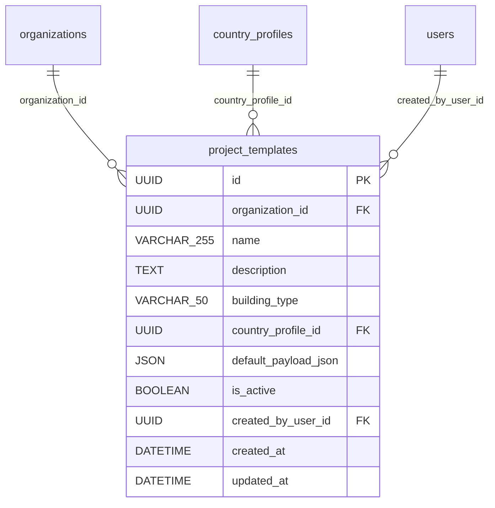
```mermaid
erDiagram
    project_templates {
        UUID id PK
        UUID organization_id FK
        VARCHAR_255 name
        TEXT description
        VARCHAR_50 building_type
        UUID country_profile_id FK
        JSON default_payload_json
        BOOLEAN is_active
        UUID created_by_user_id FK
        DATETIME created_at
        DATETIME updated_at
    }
    organizations ||--o{ project_templates : organization_id
    country_profiles ||--o{ project_templates : country_profile_id
    users ||--o{ project_templates : created_by_user_id
```

`project_templates` permet de stocker des modeles de projet reutilisables par organisation, avec un payload JSON par defaut et un contexte pays.

| Champ | Description |
| --- | --- |
| `id` | Identifiant UUID primaire, genere par l'application. |
| `organization_id` | Reference obligatoire vers `organizations.id`, suppression en cascade. |
| `name` | Nom du modele. Obligatoire. Unique avec `organization_id` via `uq_project_templates_org_name`. |
| `description` | Description optionnelle du modele. |
| `building_type` | Type de batiment vise par le modele. Obligatoire. |
| `country_profile_id` | Reference obligatoire vers `country_profiles.id`, suppression restreinte. |
| `default_payload_json` | Donnees par defaut du modele au format JSON. Obligatoire, valeur applicative par defaut `{}`. |
| `is_active` | Indique si le modele est utilisable. Obligatoire, valeur applicative et serveur `true`. |
| `created_by_user_id` | Reference obligatoire vers `users.id`, suppression restreinte. |
| `created_at` | Date de creation timezone-aware. Obligatoire, valeur applicative courante et valeur serveur `CURRENT_TIMESTAMP`. |
| `updated_at` | Date de derniere mise a jour timezone-aware. Obligatoire, mise a jour applicative et valeur serveur `CURRENT_TIMESTAMP`. |

## `projects`

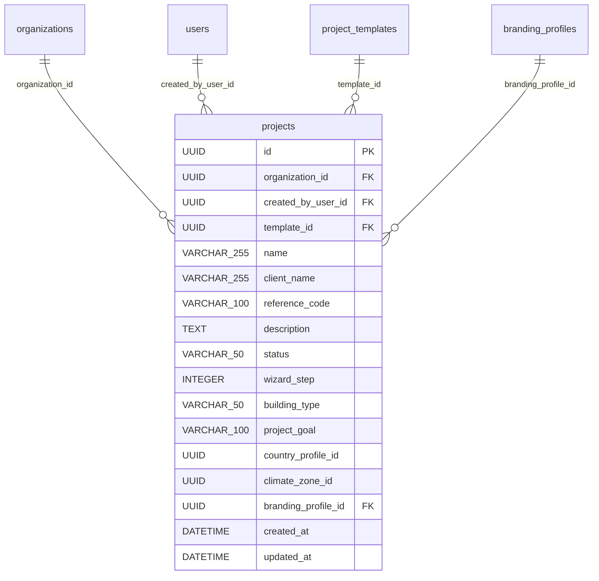
```mermaid
erDiagram
    projects {
        UUID id PK
        UUID organization_id FK
        UUID created_by_user_id FK
        UUID template_id FK
        VARCHAR_255 name
        VARCHAR_255 client_name
        VARCHAR_100 reference_code
        TEXT description
        VARCHAR_50 status
        INTEGER wizard_step
        VARCHAR_50 building_type
        VARCHAR_100 project_goal
        UUID country_profile_id
        UUID climate_zone_id
        UUID branding_profile_id FK
        DATETIME created_at
        DATETIME updated_at
    }
    organizations ||--o{ projects : organization_id
    users ||--o{ projects : created_by_user_id
    project_templates ||--o{ projects : template_id
    branding_profiles ||--o{ projects : branding_profile_id
```

`projects` est l'entite centrale de l'audit simplifie. Elle porte le contexte commercial, le statut du wizard, le type de batiment et les liens vers les donnees detaillees du projet.

| Champ | Description |
| --- | --- |
| `id` | Identifiant UUID primaire, genere par l'application. |
| `organization_id` | Reference obligatoire vers `organizations.id`, suppression en cascade. |
| `created_by_user_id` | Reference obligatoire vers `users.id`, suppression restreinte. |
| `template_id` | Reference optionnelle vers `project_templates.id`, mise a `NULL` si le template est supprime. |
| `name` | Nom du projet. Obligatoire. |
| `client_name` | Nom du client final. Optionnel. |
| `reference_code` | Code de reference commercial ou interne. Optionnel. |
| `description` | Description longue du projet. Optionnelle. |
| `status` | Statut du projet. Obligatoire, valeur serveur par defaut `'draft'`. |
| `wizard_step` | Etape courante du wizard. Obligatoire, valeur serveur par defaut `1`. |
| `building_type` | Type de batiment, par exemple hotel ou residence. Obligatoire. |
| `project_goal` | Objectif du projet. Optionnel. |
| `country_profile_id` | Identifiant optionnel du profil pays. Dans le modele SQLAlchemy actuel, ce champ n'a pas de contrainte `ForeignKey`. |
| `climate_zone_id` | Identifiant optionnel de la zone climatique. Dans le modele SQLAlchemy actuel, ce champ n'a pas de contrainte `ForeignKey`. |
| `branding_profile_id` | Reference optionnelle vers `branding_profiles.id`, mise a `NULL` si le profil est supprime. |
| `created_at` | Date de creation timezone-aware. Obligatoire, valeur applicative courante et valeur serveur `CURRENT_TIMESTAMP`. |
| `updated_at` | Date de derniere mise a jour timezone-aware. Obligatoire, mise a jour applicative et valeur serveur `CURRENT_TIMESTAMP`. |

## `scenarios`

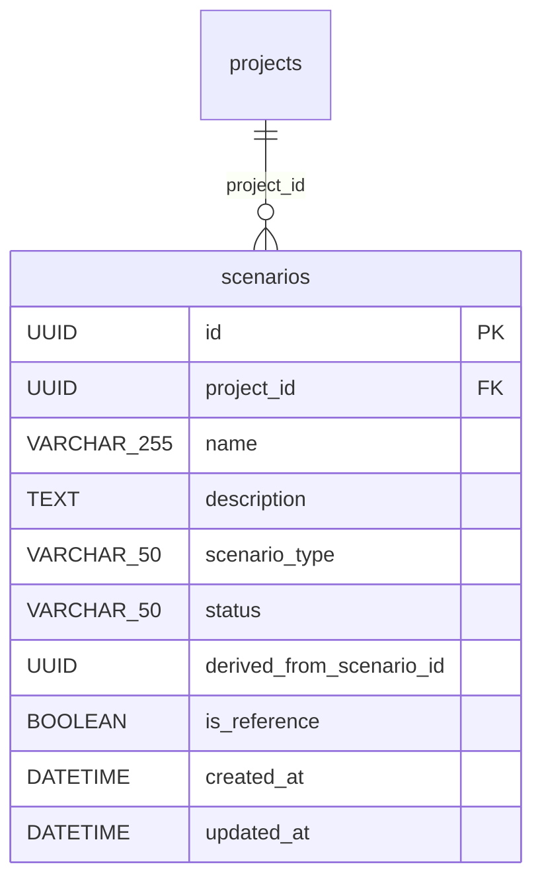
```mermaid
erDiagram
    scenarios {
        UUID id PK
        UUID project_id FK
        VARCHAR_255 name
        TEXT description
        VARCHAR_50 scenario_type
        VARCHAR_50 status
        UUID derived_from_scenario_id
        BOOLEAN is_reference
        DATETIME created_at
        DATETIME updated_at
    }
    projects ||--o{ scenarios : project_id
```

`scenarios` stocke les variantes comparees dans un projet : reference, scenarios personnalises ou derives. C'est le support principal de la comparaison de solutions.

| Champ | Description |
| --- | --- |
| `id` | Identifiant UUID primaire, genere par l'application. |
| `project_id` | Reference obligatoire vers `projects.id`, suppression en cascade. |
| `name` | Nom du scenario. Obligatoire. |
| `description` | Description optionnelle du scenario. |
| `scenario_type` | Type de scenario. Obligatoire, valeur applicative et serveur `'custom'`. |
| `status` | Statut du scenario. Obligatoire, valeur applicative et serveur `'draft'`. |
| `derived_from_scenario_id` | Identifiant optionnel d'un scenario source. Dans le modele SQLAlchemy actuel, ce champ n'a pas de contrainte `ForeignKey`. |
| `is_reference` | Indique si le scenario est le scenario de reference. Obligatoire, valeur applicative par defaut `false`. |
| `created_at` | Date de creation timezone-aware. Obligatoire, valeur applicative courante et valeur serveur `CURRENT_TIMESTAMP`. |
| `updated_at` | Date de derniere mise a jour timezone-aware. Obligatoire, mise a jour applicative et valeur serveur `CURRENT_TIMESTAMP`. |

## `scenario_solution_assignments`

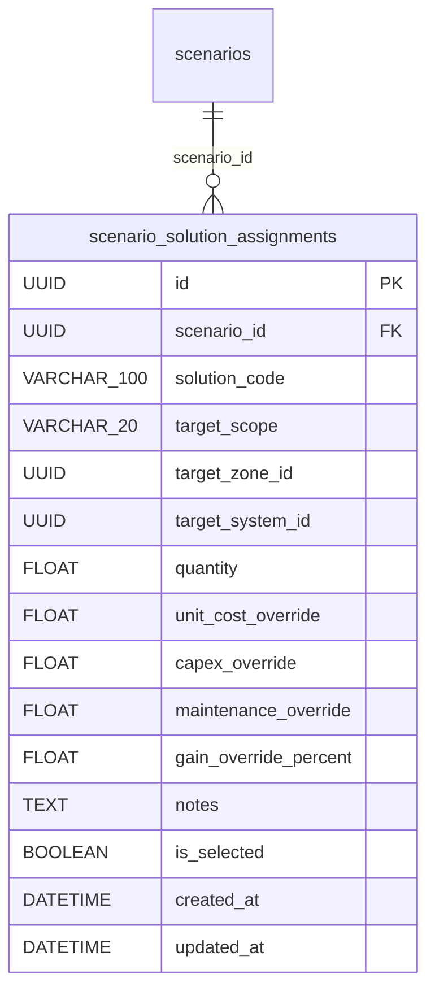
```mermaid
erDiagram
    scenario_solution_assignments {
        UUID id PK
        UUID scenario_id FK
        VARCHAR_100 solution_code
        VARCHAR_20 target_scope
        UUID target_zone_id
        UUID target_system_id
        FLOAT quantity
        FLOAT unit_cost_override
        FLOAT capex_override
        FLOAT maintenance_override
        FLOAT gain_override_percent
        TEXT notes
        BOOLEAN is_selected
        DATETIME created_at
        DATETIME updated_at
    }
    scenarios ||--o{ scenario_solution_assignments : scenario_id
```

`scenario_solution_assignments` liste les solutions retenues dans un scenario et leurs surcharges de quantite, cout ou gain. Le lien vers la solution se fait par `solution_code` et non par cle etrangere vers `solution_definitions`.

| Champ | Description |
| --- | --- |
| `id` | Identifiant UUID primaire, genere par l'application. |
| `scenario_id` | Reference obligatoire vers `scenarios.id`, suppression en cascade. |
| `solution_code` | Code de la solution assignee. Obligatoire, sans contrainte `ForeignKey` vers `solution_definitions.code`. |
| `target_scope` | Perimetre cible de l'action. Obligatoire, valeur applicative par defaut `project`. |
| `target_zone_id` | Identifiant optionnel de zone cible. Dans le modele SQLAlchemy actuel, ce champ n'a pas de contrainte `ForeignKey`. |
| `target_system_id` | Identifiant optionnel de systeme cible. Dans le modele SQLAlchemy actuel, ce champ n'a pas de contrainte `ForeignKey`. |
| `quantity` | Quantite appliquee. Optionnelle. |
| `unit_cost_override` | Surcharge optionnelle du cout unitaire. |
| `capex_override` | Surcharge optionnelle du CAPEX. |
| `maintenance_override` | Surcharge optionnelle du cout de maintenance. |
| `gain_override_percent` | Surcharge optionnelle du gain en pourcentage. |
| `notes` | Notes libres sur l'assignation. Optionnelles. |
| `is_selected` | Indique si l'assignation est retenue dans le scenario. Obligatoire, valeur applicative et serveur `true`. |
| `created_at` | Date de creation timezone-aware. Obligatoire, valeur applicative courante et valeur serveur `CURRENT_TIMESTAMP`. |
| `updated_at` | Date de derniere mise a jour timezone-aware. Obligatoire, mise a jour applicative et valeur serveur `CURRENT_TIMESTAMP`. |

## `calculation_assumption_sets`

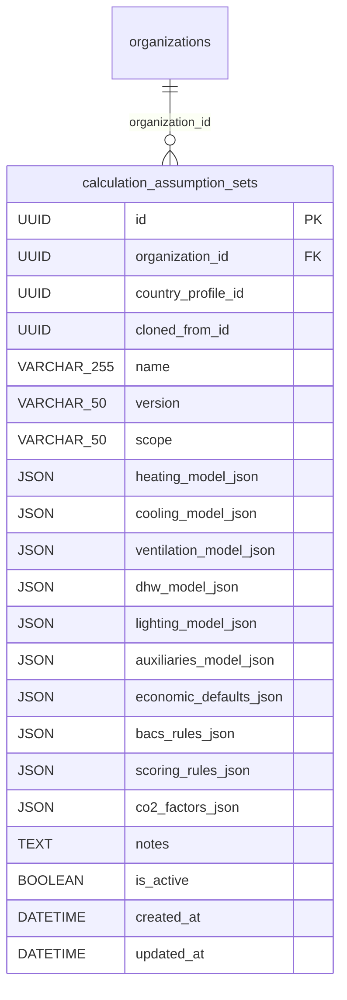
```mermaid
erDiagram
    calculation_assumption_sets {
        UUID id PK
        UUID organization_id FK
        UUID country_profile_id
        UUID cloned_from_id
        VARCHAR_255 name
        VARCHAR_50 version
        VARCHAR_50 scope
        JSON heating_model_json
        JSON cooling_model_json
        JSON ventilation_model_json
        JSON dhw_model_json
        JSON lighting_model_json
        JSON auxiliaries_model_json
        JSON economic_defaults_json
        JSON bacs_rules_json
        JSON scoring_rules_json
        JSON co2_factors_json
        TEXT notes
        BOOLEAN is_active
        DATETIME created_at
        DATETIME updated_at
    }
    organizations ||--o{ calculation_assumption_sets : organization_id
```

`calculation_assumption_sets` versionne les hypotheses du moteur de calcul : modeles energie, regles BACS, regles de scoring, facteurs CO2 et parametres economiques.

| Champ | Description |
| --- | --- |
| `id` | Identifiant UUID primaire, genere par l'application. |
| `organization_id` | Reference optionnelle vers `organizations.id`, suppression en cascade. Nul pour un jeu d'hypotheses non specifique a une organisation. |
| `country_profile_id` | Identifiant optionnel de profil pays. Dans le modele SQLAlchemy actuel, ce champ n'a pas de contrainte `ForeignKey`. |
| `cloned_from_id` | Identifiant optionnel du jeu d'hypotheses source. Dans le modele SQLAlchemy actuel, ce champ n'a pas de contrainte `ForeignKey`. |
| `name` | Nom du jeu d'hypotheses. Obligatoire. |
| `version` | Version fonctionnelle du jeu d'hypotheses. Obligatoire. |
| `scope` | Portee du jeu, par exemple defaut plateforme, pays ou organisation. Obligatoire. Unique avec `version`, `organization_id` et `country_profile_id` via `uq_assumption_set_scope_version`. |
| `heating_model_json` | Hypotheses chauffage au format JSON. Obligatoire, valeur applicative par defaut `{}`. |
| `cooling_model_json` | Hypotheses refroidissement au format JSON. Obligatoire, valeur applicative par defaut `{}`. |
| `ventilation_model_json` | Hypotheses ventilation au format JSON. Obligatoire, valeur applicative par defaut `{}`. |
| `dhw_model_json` | Hypotheses ECS au format JSON. Obligatoire, valeur applicative par defaut `{}`. |
| `lighting_model_json` | Hypotheses eclairage au format JSON. Obligatoire, valeur applicative par defaut `{}`. |
| `auxiliaries_model_json` | Hypotheses auxiliaires au format JSON. Obligatoire, valeur applicative par defaut `{}`. |
| `economic_defaults_json` | Hypotheses economiques par defaut au format JSON. Obligatoire, valeur applicative par defaut `{}`. |
| `bacs_rules_json` | Regles BACS au format JSON. Obligatoire, valeur applicative par defaut `{}`. |
| `scoring_rules_json` | Regles de scoring scenario au format JSON. Obligatoire, valeur applicative par defaut `{}`. |
| `co2_factors_json` | Facteurs CO2 au format JSON. Obligatoire, valeur applicative par defaut `{}`. |
| `notes` | Notes de version ou de contexte. Optionnelles. |
| `is_active` | Indique si le jeu d'hypotheses est actif. Obligatoire, valeur applicative et serveur `false`. |
| `created_at` | Date de creation timezone-aware. Obligatoire, valeur applicative courante et valeur serveur `CURRENT_TIMESTAMP`. |
| `updated_at` | Date de derniere mise a jour timezone-aware. Obligatoire, mise a jour applicative et valeur serveur `CURRENT_TIMESTAMP`. |

## `calculation_runs`

```mermaid
erDiagram
    calculation_runs {
        UUID id PK
        UUID project_id FK
        UUID scenario_id FK
        VARCHAR_50 status
        VARCHAR_50 engine_version
        JSON input_snapshot
        JSON messages_json
        JSON warnings_json
        TEXT notes
        DATETIME created_at
    }
    projects ||--o{ calculation_runs : project_id
    scenarios ||--o{ calculation_runs : scenario_id
```

`calculation_runs` trace chaque execution du moteur de calcul pour un scenario. Elle conserve le snapshot d'entree et les messages afin de rendre le calcul reproductible.

| Champ | Description |
| --- | --- |
| `id` | Identifiant UUID primaire, genere par l'application. |
| `project_id` | Reference obligatoire vers `projects.id`, suppression en cascade. |
| `scenario_id` | Reference obligatoire vers `scenarios.id`, suppression en cascade. |
| `status` | Statut de l'execution. Obligatoire, valeur applicative par defaut `completed`. |
| `engine_version` | Version du moteur utilisee. Obligatoire. |
| `input_snapshot` | Snapshot JSON complet des entrees et hypotheses utilisees. Obligatoire. |
| `messages_json` | Messages produits par le calcul au format JSON. Obligatoire, valeur applicative par defaut `[]`. |
| `warnings_json` | Avertissements produits par le calcul au format JSON. Obligatoire, valeur applicative par defaut `[]`. |
| `notes` | Notes libres sur l'execution. Optionnelles. |
| `created_at` | Date de creation timezone-aware. Obligatoire, valeur applicative courante et valeur serveur `CURRENT_TIMESTAMP`. |

## `result_summaries`

```mermaid
erDiagram
    result_summaries {
        UUID id PK
        UUID calculation_run_id FK
        FLOAT baseline_energy_kwh_year
        FLOAT scenario_energy_kwh_year
        FLOAT energy_savings_percent
        VARCHAR_5 baseline_bacs_class
        VARCHAR_5 scenario_bacs_class
    }
    calculation_runs ||--|| result_summaries : calculation_run_id
```

`result_summaries` contient les principaux indicateurs energie et BACS d'un calcul. La relation est un-pour-un avec `calculation_runs`.

| Champ | Description |
| --- | --- |
| `id` | Identifiant UUID primaire, genere par l'application. |
| `calculation_run_id` | Reference obligatoire et unique vers `calculation_runs.id`, suppression en cascade. |
| `baseline_energy_kwh_year` | Energie annuelle de reference en kWh/an. Obligatoire. |
| `scenario_energy_kwh_year` | Energie annuelle apres scenario en kWh/an. Obligatoire. |
| `energy_savings_percent` | Economie d'energie en pourcentage. Obligatoire. |
| `baseline_bacs_class` | Classe BACS de reference. Optionnelle. |
| `scenario_bacs_class` | Classe BACS apres scenario. Optionnelle. |

## `economic_results`

```mermaid
erDiagram
    economic_results {
        UUID id PK
        UUID calculation_run_id FK
        FLOAT total_capex
        FLOAT subsidies
        FLOAT net_capex
        FLOAT baseline_opex_year
        FLOAT scenario_opex_year
        FLOAT energy_cost_savings
        FLOAT maintenance_cost_year
        FLOAT maintenance_savings_year
        FLOAT net_annual_savings
        FLOAT annual_cost_savings
        FLOAT simple_payback_years
        FLOAT npv
        FLOAT irr
        INTEGER analysis_period_years
        FLOAT discount_rate
        FLOAT energy_inflation_rate
        JSON cash_flows
        BOOLEAN is_roi_calculable
    }
    calculation_runs ||--|| economic_results : calculation_run_id
```

`economic_results` stocke les resultats economiques calcules pour une execution : CAPEX, OPEX, economies, retour simple, VAN, TRI et flux de tresorerie.

| Champ | Description |
| --- | --- |
| `id` | Identifiant UUID primaire, genere par l'application. |
| `calculation_run_id` | Reference obligatoire et unique vers `calculation_runs.id`, suppression en cascade. |
| `total_capex` | CAPEX total brut. Obligatoire. |
| `subsidies` | Subventions ou aides. Optionnel. |
| `net_capex` | CAPEX net apres subventions. Optionnel. |
| `baseline_opex_year` | OPEX annuel de reference. Optionnel. |
| `scenario_opex_year` | OPEX annuel du scenario. Optionnel. |
| `energy_cost_savings` | Economies annuelles de cout energie. Optionnel. |
| `maintenance_cost_year` | Cout annuel de maintenance. Optionnel. |
| `maintenance_savings_year` | Economies annuelles de maintenance. Optionnel. |
| `net_annual_savings` | Economies annuelles nettes. Optionnel. |
| `annual_cost_savings` | Economies annuelles de cout. Obligatoire. |
| `simple_payback_years` | Temps de retour simple en annees. Optionnel. |
| `npv` | Valeur actuelle nette. Obligatoire. |
| `irr` | Taux de rentabilite interne. Optionnel. |
| `analysis_period_years` | Periode d'analyse retenue, en annees. Optionnelle. |
| `discount_rate` | Taux d'actualisation retenu. Optionnel. |
| `energy_inflation_rate` | Taux d'inflation energie retenu. Optionnel. |
| `cash_flows` | Flux de tresorerie au format JSON. Optionnel. |
| `is_roi_calculable` | Indique si les indicateurs ROI sont calculables. Optionnel. |

## `result_by_use`

```mermaid
erDiagram
    result_by_use {
        UUID id PK
        UUID calculation_run_id FK
        VARCHAR_50 usage_type
        FLOAT baseline_energy_kwh_year
        FLOAT scenario_energy_kwh_year
        FLOAT energy_savings_percent
    }
    calculation_runs ||--o{ result_by_use : calculation_run_id
```

`result_by_use` decompose les resultats energie par usage. Elle permet d'expliquer les gains par categorie fonctionnelle de consommation.

| Champ | Description |
| --- | --- |
| `id` | Identifiant UUID primaire, genere par l'application. |
| `calculation_run_id` | Reference obligatoire vers `calculation_runs.id`, suppression en cascade. |
| `usage_type` | Type d'usage energetique. Obligatoire. |
| `baseline_energy_kwh_year` | Energie annuelle de reference pour cet usage en kWh/an. Obligatoire. |
| `scenario_energy_kwh_year` | Energie annuelle apres scenario pour cet usage en kWh/an. Obligatoire. |
| `energy_savings_percent` | Economie d'energie de cet usage en pourcentage. Obligatoire. |

## `result_by_zone`

```mermaid
erDiagram
    result_by_zone {
        UUID id PK
        UUID calculation_run_id FK
        UUID zone_id
        VARCHAR_255 zone_name
        VARCHAR_50 zone_type
        VARCHAR_20 orientation
        FLOAT baseline_energy_kwh_year
        FLOAT scenario_energy_kwh_year
        FLOAT energy_savings_percent
    }
    calculation_runs ||--o{ result_by_zone : calculation_run_id
```

`result_by_zone` decompose les resultats energie par zone du batiment. Les champs de zone sont denormalises pour conserver le contexte du calcul meme si les zones du projet evoluent.

| Champ | Description |
| --- | --- |
| `id` | Identifiant UUID primaire, genere par l'application. |
| `calculation_run_id` | Reference obligatoire vers `calculation_runs.id`, suppression en cascade. |
| `zone_id` | Identifiant optionnel de la zone source. Dans le modele SQLAlchemy actuel, ce champ n'a pas de contrainte `ForeignKey`. |
| `zone_name` | Nom de la zone au moment du calcul. Obligatoire. |
| `zone_type` | Type de zone au moment du calcul. Obligatoire. |
| `orientation` | Orientation au moment du calcul. Obligatoire, valeur applicative par defaut `mixed`. |
| `baseline_energy_kwh_year` | Energie annuelle de reference de la zone en kWh/an. Obligatoire. |
| `scenario_energy_kwh_year` | Energie annuelle apres scenario de la zone en kWh/an. Obligatoire. |
| `energy_savings_percent` | Economie d'energie de la zone en pourcentage. Obligatoire. |

## `generated_reports`

```mermaid
erDiagram
    generated_reports {
        UUID id PK
        UUID organization_id FK
        UUID project_id FK
        UUID scenario_id FK
        UUID calculation_run_id FK
        UUID branding_profile_id FK
        VARCHAR_50 report_type
        VARCHAR_50 status
        VARCHAR_255 title
        VARCHAR_255 file_name
        VARCHAR_100 mime_type
        TEXT storage_path
        INTEGER file_size_bytes
        VARCHAR_50 generator_version
        DATETIME created_at
    }
    organizations ||--o{ generated_reports : organization_id
    projects ||--o{ generated_reports : project_id
    scenarios ||--o{ generated_reports : scenario_id
    calculation_runs ||--o{ generated_reports : calculation_run_id
    branding_profiles ||--o{ generated_reports : branding_profile_id
```

`generated_reports` reference les artefacts de rapport produits par l'application. Elle stocke les metadonnees de generation et le chemin de stockage du fichier.

| Champ | Description |
| --- | --- |
| `id` | Identifiant UUID primaire, genere par l'application. |
| `organization_id` | Reference obligatoire vers `organizations.id`, suppression en cascade. |
| `project_id` | Reference obligatoire vers `projects.id`, suppression en cascade. |
| `scenario_id` | Reference obligatoire vers `scenarios.id`, suppression en cascade. |
| `calculation_run_id` | Reference obligatoire vers `calculation_runs.id`, suppression en cascade. |
| `branding_profile_id` | Reference optionnelle vers `branding_profiles.id`, mise a `NULL` si le profil est supprime. |
| `report_type` | Type de rapport genere. Obligatoire. |
| `status` | Statut du rapport. Obligatoire, valeur applicative par defaut `generated`. |
| `title` | Titre du rapport. Obligatoire. |
| `file_name` | Nom du fichier genere. Obligatoire. |
| `mime_type` | Type MIME du fichier. Obligatoire. |
| `storage_path` | Chemin de stockage de l'artefact. Obligatoire. |
| `file_size_bytes` | Taille du fichier en octets. Obligatoire. |
| `generator_version` | Version du generateur de rapport. Obligatoire. |
| `created_at` | Date de creation timezone-aware. Obligatoire, valeur applicative courante et valeur serveur `CURRENT_TIMESTAMP`. |

## `branding_profiles`

```mermaid
erDiagram
    branding_profiles {
        UUID id PK
        UUID organization_id FK
        VARCHAR_255 name
        VARCHAR_255 company_name
        VARCHAR_20 accent_color
        VARCHAR_50 logo_text
        VARCHAR_255 contact_email
        VARCHAR_255 cover_tagline
        TEXT footer_note
        BOOLEAN is_default
        DATETIME created_at
    }
    organizations ||--o{ branding_profiles : organization_id
```

`branding_profiles` stocke les parametres de marque utilises dans l'interface et les rapports : societe, couleur, texte de logo, contact et mentions.

| Champ | Description |
| --- | --- |
| `id` | Identifiant UUID primaire, genere par l'application. |
| `organization_id` | Reference obligatoire vers `organizations.id`, suppression en cascade. |
| `name` | Nom interne du profil de marque. Obligatoire. |
| `company_name` | Nom de societe affiche. Obligatoire. |
| `accent_color` | Couleur d'accent, stockee en chaine. Obligatoire. |
| `logo_text` | Texte court utilise comme logo. Optionnel. |
| `contact_email` | Email de contact. Optionnel. |
| `cover_tagline` | Accroche de couverture. Optionnelle. |
| `footer_note` | Note de pied de page. Optionnelle. |
| `is_default` | Indique si le profil est le profil par defaut. Obligatoire, valeur serveur `false`. |
| `created_at` | Date de creation timezone-aware. Obligatoire, valeur applicative courante et valeur serveur `CURRENT_TIMESTAMP`. |

## `audit_logs`

```mermaid
erDiagram
    audit_logs {
        UUID id PK
        VARCHAR_100 entity_type
        UUID entity_id
        VARCHAR_100 action
        JSON before_json
        JSON after_json
        UUID user_id FK
        UUID organization_id FK
        UUID project_id FK
        UUID scenario_id FK
        DATETIME timestamp
    }
    users ||--o{ audit_logs : user_id
    organizations ||--o{ audit_logs : organization_id
    projects ||--o{ audit_logs : project_id
    scenarios ||--o{ audit_logs : scenario_id
```

`audit_logs` trace les changements significatifs sur les entites metier. La table conserve l'entite concernee, l'action, les snapshots avant/apres et le contexte utilisateur, organisation, projet et scenario.

| Champ | Description |
| --- | --- |
| `id` | Identifiant UUID primaire, genere par l'application. |
| `entity_type` | Type d'entite concernee. Obligatoire. |
| `entity_id` | Identifiant de l'entite concernee. Obligatoire, sans contrainte generique de cle etrangere. |
| `action` | Action auditee. Obligatoire. |
| `before_json` | Etat avant modification au format JSON. Optionnel. |
| `after_json` | Etat apres modification au format JSON. Optionnel. |
| `user_id` | Reference optionnelle vers `users.id`, mise a `NULL` si l'utilisateur est supprime. |
| `organization_id` | Reference obligatoire vers `organizations.id`, suppression en cascade. |
| `project_id` | Reference optionnelle vers `projects.id`, suppression en cascade. |
| `scenario_id` | Reference optionnelle vers `scenarios.id`, mise a `NULL` si le scenario est supprime. |
| `timestamp` | Date de l'evenement audite. Obligatoire, valeur applicative courante et valeur serveur `CURRENT_TIMESTAMP`. |
