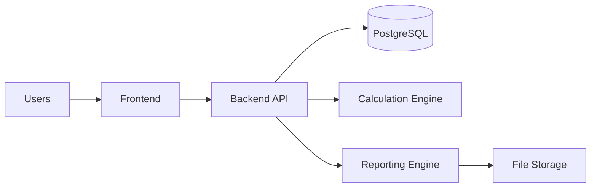
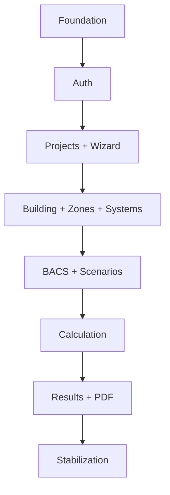
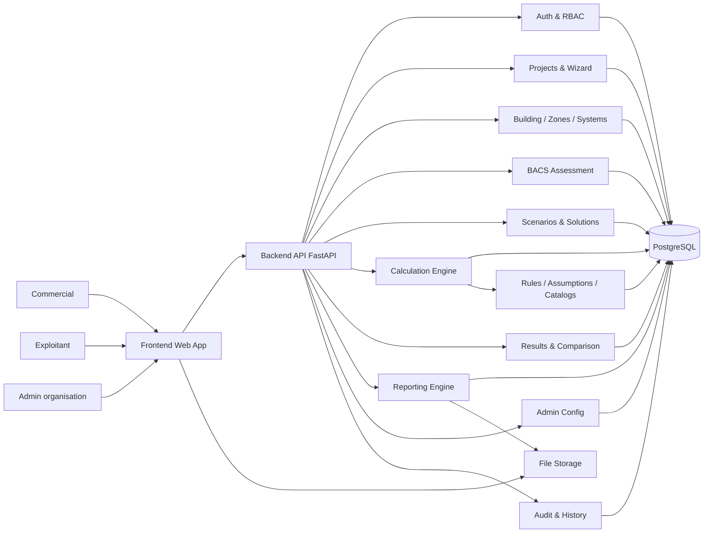
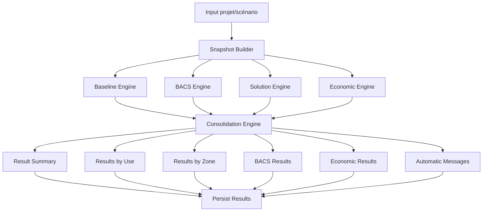
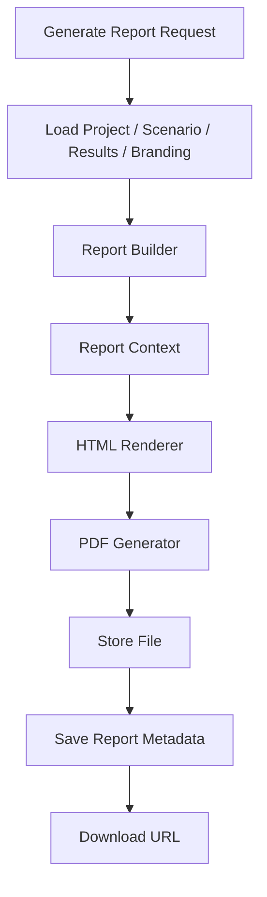
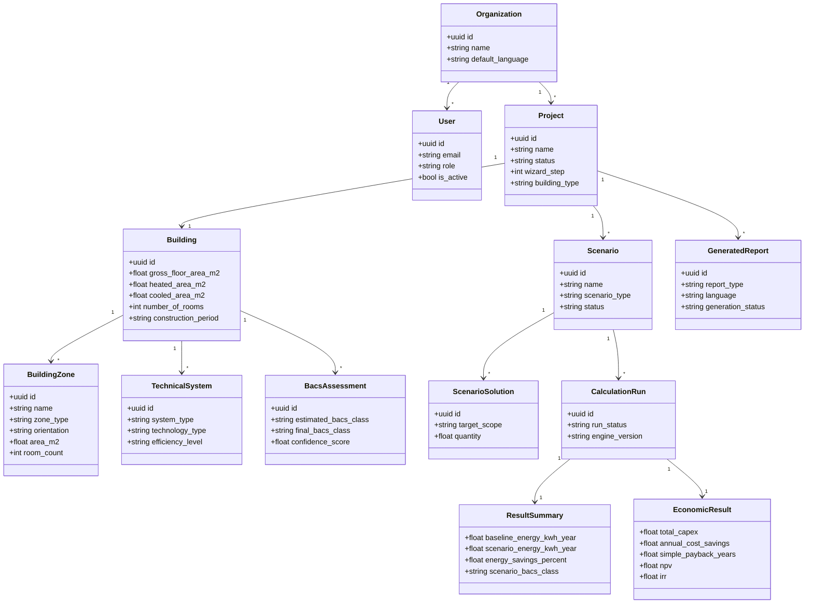
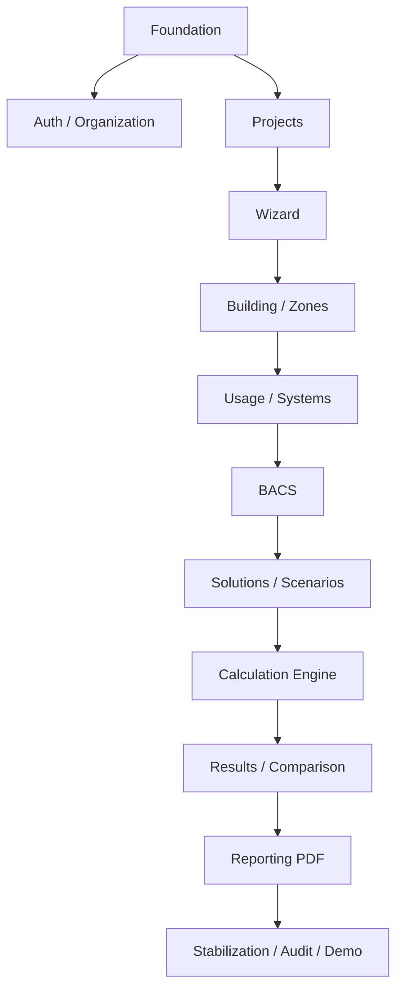

# Mermaid Diagrams

## System view

## Delivery dependency view

# 12. Schéma Mermaid global du système

## 12.1 Vue système globale

Cette vue montre les grands blocs :

* utilisateurs,
* frontend,
* backend,
* moteur de calcul,
* reporting,
* base de données,
* stockage fichiers,
* référentiels.

---

## 12.2 Vue backend modulaire

Cette vue détaille le découpage interne du backend.

```mermaid
flowchart TD
    API[API Layer]

    API --> S_AUTH[Auth Service]
    API --> S_USERS[User Service]
    API --> S_ORG[Organization Service]
    API --> S_BRAND[Branding Service]
    API --> S_PROJ[Project Service]
    API --> S_WIZ[Wizard Service]
    API --> S_BUILD[Building Service]
    API --> S_ZONE[Zone Service]
    API --> S_USAGE[Usage Service]
    API --> S_SYS[System Service]
    API --> S_BACS[BACS Service]
    API --> S_SOL[Solution Service]
    API --> S_SCEN[Scenario Service]
    API --> S_CALC[Calculation Service]
    API --> S_RES[Result Service]
    API --> S_REP[Report Service]
    API --> S_ADMIN[Admin Service]
    API --> S_AUDIT[Audit Service]

    S_AUTH --> R_AUTH[Repositories]
    S_USERS --> R_USERS[Repositories]
    S_ORG --> R_ORG[Repositories]
    S_BRAND --> R_BRAND[Repositories]
    S_PROJ --> R_PROJ[Repositories]
    S_WIZ --> R_WIZ[Repositories]
    S_BUILD --> R_BUILD[Repositories]
    S_ZONE --> R_ZONE[Repositories]
    S_USAGE --> R_USAGE[Repositories]
    S_SYS --> R_SYS[Repositories]
    S_BACS --> R_BACS[Repositories]
    S_SOL --> R_SOL[Repositories]
    S_SCEN --> R_SCEN[Repositories]
    S_CALC --> R_CALC[Repositories]
    S_RES --> R_RES[Repositories]
    S_REP --> R_REP[Repositories]
    S_ADMIN --> R_ADMIN[Repositories]
    S_AUDIT --> R_AUDIT[Repositories]

    S_CALC --> ENGINE[Calculation Engine]
    S_REP --> REPORTING[Reporting Engine]

    R_AUTH --> DB[(PostgreSQL)]
    R_USERS --> DB
    R_ORG --> DB
    R_BRAND --> DB
    R_PROJ --> DB
    R_WIZ --> DB
    R_BUILD --> DB
    R_ZONE --> DB
    R_USAGE --> DB
    R_SYS --> DB
    R_BACS --> DB
    R_SOL --> DB
    R_SCEN --> DB
    R_CALC --> DB
    R_RES --> DB
    R_REP --> DB
    R_ADMIN --> DB
    R_AUDIT --> DB

    ENGINE --> RULES[Assumptions / Climate / BACS Rules / Catalogs]
    REPORTING --> FILES[PDF Storage]
```

---

## 12.3 Flux métier principal

Cette vue suit le parcours utilisateur principal du MVP.

```mermaid
flowchart LR
    A[Connexion] --> B[Créer un projet]
    B --> C[Wizard - Contexte]
    C --> D[Wizard - Bâtiment]
    D --> E[Wizard - Zones]
    E --> F[Wizard - Usages]
    F --> G[Wizard - Systèmes]
    G --> H[Wizard - BACS actuel]
    H --> I[Créer un scénario]
    I --> J[Ajouter des solutions]
    J --> K[Vérifier readiness]
    K --> L[Lancer calcul]
    L --> M[Consulter résultats]
    M --> N[Comparer scénarios]
    N --> O[Générer rapport PDF]
    O --> P[Télécharger / partager]
```

---

## 12.4 Flux de calcul détaillé

Cette vue montre le pipeline du moteur de calcul.

---

## 12.5 Flux reporting PDF

Cette vue montre comment le rapport est produit.

---

## 12.6 Vue entités métier principales

Cette vue donne une lecture structurée des principaux objets fonctionnels.

---

## 12.7 Vue des dépendances MVP

Cette vue est utile pour le pilotage du développement.

---

## 12.8 Recommandation d’usage de ces schémas

Je vous recommande de conserver ces diagrammes comme base de documentation projet, avec les usages suivants :

* **12.1** pour la vue d’ensemble produit,
* **12.2** pour cadrer l’architecture backend,
* **12.3** pour expliquer le parcours utilisateur,
* **12.4** pour le moteur de calcul,
* **12.5** pour la génération des rapports,
* **12.6** pour la lecture métier / data,
* **12.7** pour le pilotage MVP.

---

