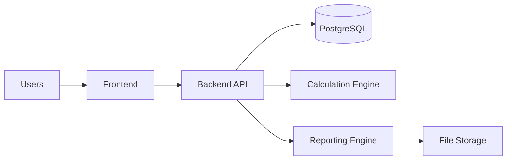
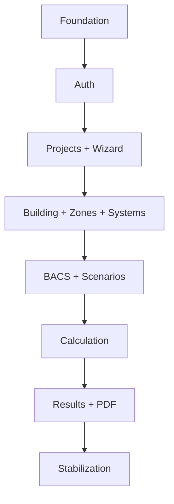

# Mermaid Diagrams

## System view

```mermaid
flowchart LR
    U[Users] --> FE[Frontend]
    FE --> API[Backend API]
    API --> DB[(PostgreSQL)]
    API --> CALC[Calculation Engine]
    API --> REP[Reporting Engine]
    REP --> FILES[File Storage]
```

## Delivery dependency view

```mermaid
flowchart TD
    F1[Foundation] --> F2[Auth]
    F2 --> F3[Projects + Wizard]
    F3 --> F4[Building + Zones + Systems]
    F4 --> F5[BACS + Scenarios]
    F5 --> F6[Calculation]
    F6 --> F7[Results + PDF]
    F7 --> F8[Stabilization]
```
